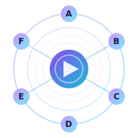

<p align="center">
  
</p>

<h1 align="center">Agent Orchestrator</h1>

<p align="center">
  <strong>Provider-agnostic AI agent orchestration framework</strong><br>
  Swap LLM providers per agent, route tasks by complexity, mix cloud and local models.
</p>

<p align="center">
  <a href="https://pjcau.github.io/agent-orchestrator/"></a>
  <a href="https://pjcau.github.io/agent-orchestrator/docs/architecture/providers"></a>
  <a href="https://pjcau.github.io/agent-orchestrator/docs/architecture/agents"></a>
  <a href="https://pjcau.github.io/agent-orchestrator/docs/architecture/overview#routing-strategies"></a>
</p>

---

## Why

Current agent tools lock you into one provider. This framework:

- **Abstracts the provider** — same agent runs on Claude, GPT, Gemini, or local models
- **Routes by cost** — simple tasks go to cheap models, complex ones to frontier
- **Mixes cloud + local** — sensitive code stays on your hardware
- **Built-in anti-stall** — retry caps, timeouts, deadlock detection
- **Hybrid architecture** — React frontend + optional Rust core engine (PyO3) for performance-critical paths

## Quick Start

```bash
pip install -e ".[all]"

# Optional: Rust acceleration (requires Rust toolchain)
cd rust && maturin develop --release && cd ..

# Start dashboard (needs Docker/OrbStack)
docker compose up dashboard -d    # http://localhost:5005
```

### Drive the orchestrator against your local project

The `ago` CLI keeps the multi-agent loop on a hosted dashboard
(`agents-orchestrator.com` or your own) while delegating every
`file_read` / `file_write` / `shell_exec` back to your `cwd` — the
team-lead routes the work, `team-lead`/`backend`/`frontend`/`ai-engineer`/…
all run server-side, the resulting files land in your repo.

```bash
# Install the prebuilt binary
AGO_VERSION=ago-v0.5.4 ~/installAgo.sh --version
ln -sf ~/.cache/ago/ago-v0.5.4/ago ~/.local/bin/ago

# Login once (browser device flow, no API key to copy)
ago login --device --server https://agents-orchestrator.com

# Multi-turn chat with local file delegation
cd ~/projects/my-app
ago chat --client-tools
```

End-to-end guide (install, `.ago.yaml`, daily usage, security defaults,
troubleshooting): [docs/managing-local-projects.md](docs/managing-local-projects.md).
Architecture + threat model: [docs/agent-host.md](docs/agent-host.md).

## Core Concepts

| Concept | Description | Docs |
|---------|-------------|------|
| **Provider** | LLM backend — swappable per agent | [Providers](https://pjcau.github.io/agent-orchestrator/docs/architecture/providers) |
| **Agent** | Autonomous unit with role, tools, provider | [Agents](https://pjcau.github.io/agent-orchestrator/docs/architecture/agents) |
| **Skill** | Reusable capability, provider-independent | [Skills](https://pjcau.github.io/agent-orchestrator/docs/architecture/skills) |
| **StateGraph** | Directed graph engine for orchestration flows | [Graph Engine](https://pjcau.github.io/agent-orchestrator/docs/architecture/graph-engine) |
| **Cooperation** | Inter-agent delegation and conflict resolution | [Cooperation](https://pjcau.github.io/agent-orchestrator/docs/architecture/cooperation) |

## StateGraph Example

```python
from agent_orchestrator.core.graph import END, START, StateGraph
from agent_orchestrator.core.llm_nodes import llm_node
from agent_orchestrator.providers.local import LocalProvider

provider = LocalProvider(model="qwen2.5-coder:7b-instruct")

analyze = llm_node(provider=provider, system="Analyze the code.", prompt_key="code", output_key="analysis")
fix = llm_node(provider=provider, system="Fix the code.", prompt_template=lambda s: f"Analysis:\n{s['analysis']}\n\nCode:\n{s['code']}", output_key="fixed")

graph = StateGraph()
graph.add_node("analyze", analyze)
graph.add_node("fix", fix)
graph.add_edge(START, "analyze")
graph.add_edge("analyze", "fix")
graph.add_edge("fix", END)

result = await graph.compile().invoke({"code": "def avg(lst): return sum(lst) / len(lst)"})
```

Parallel execution, conditional routing, human-in-the-loop, checkpointing, sub-graphs, map-reduce — see [Graph Engine docs](https://pjcau.github.io/agent-orchestrator/docs/architecture/graph-engine).

## Documentation

| | |
|---|---|
| [Local projects via `ago chat --client-tools`](docs/managing-local-projects.md) | End-to-end recipe: install, login, `.ago.yaml`, daily use, security |
| [Agent Host protocol](docs/agent-host.md) | Wire protocol, threat model, operator runbook |
| [Architecture](https://pjcau.github.io/agent-orchestrator/docs/architecture/overview) | Core design, abstractions, components |
| [Responsive layout](https://pjcau.github.io/agent-orchestrator/docs/architecture/responsive-layout) | Desktop + tablet + mobile (incl. iPhone notch), breakpoints, lint, cross-viewport E2E |
| [Roadmap](https://pjcau.github.io/agent-orchestrator/docs/roadmap/overview) | Phases 0-3, version milestones |
| [Business](https://pjcau.github.io/agent-orchestrator/docs/business/strategy) | Strategy, cost analysis, infrastructure |
| [Security](docs/security.md) | Auth, RBAC, secrets, AWS deployment checklist |
| [Migration](https://pjcau.github.io/agent-orchestrator/docs/architecture/migration-from-claude) | How to abstract away from Claude Code |

## Responsive Layout

The dashboard ships a **single React/CSS codebase** that adapts to desktop, tablet, and mobile — including iPhones with a notch / dynamic island.

- **Breakpoints**: one source of truth in `frontend/src/lib/breakpoints.ts` (`mobile <768px`, `tablet 768–1023px`, `desktop ≥1024px`).
- **Runtime detection**: `useBreakpoint()` hook (`frontend/src/hooks/useBreakpoint.ts`) — SSR-safe, reactive, replaces direct `window.innerWidth` reads.
- **iOS safe-area**: `viewport-fit=cover` + `env(safe-area-inset-*)` padding on the header and chat input.
- **Lint guard**: `scripts/check_responsive.sh` (wired into CI) blocks new hardcoded breakpoints and stray `window.innerWidth` reads; a baseline pins pre-existing exceptions.
- **Cross-viewport E2E**: `frontend/e2e/chat-smoke.spec.ts` runs on both 375×667 (iPhone SE) and 1440×900 (desktop) every CI build (`npm run e2e` locally).
- **PR template**: `.github/PULL_REQUEST_TEMPLATE.md` includes a Responsive Check that reviewers tick before merging UI work.

Full details — including the migration path off the legacy 600px/900px breakpoints and what's intentionally not yet automated (visual regression) — in [docs/architecture/responsive-layout](https://pjcau.github.io/agent-orchestrator/docs/architecture/responsive-layout).

## Development

```bash
pip install -e ".[dev]"
pytest                              # 1692+ tests
ruff check src/ tests/              # lint
docker compose up docs -d           # docs site at http://localhost:3000
```

## Status

v1.0.0 — 5 providers, StateGraph engine, 30 agents, React frontend, Rust core engine (PyO3), real-time dashboard, fail-closed auth, embedded client, YAML config, Slack/Telegram integrations, loop detection, sandbox execution, document upload, clarification system, 1692+ tests.
