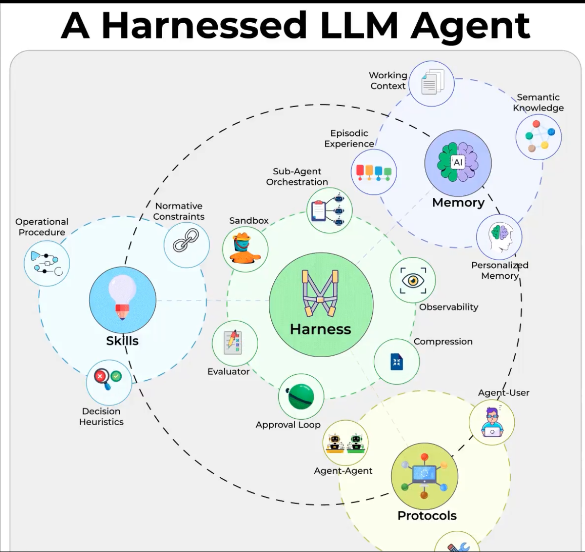

# Harnessed LLM Agent — Overview

## What this analysis is

A conceptual model of what an **"harnessed" LLM agent** is made of — the model itself is only the brain; the *harness* is everything around it that makes the agent reliable, observable, controllable, and useful in production.

This document maps each component of the reference diagram to:

1. The **motivation** (why it exists)
2. **Famous open-source repos** that implement the pattern
3. The **match** against the current `agent-orchestrator` codebase (have / partial / missing)
4. A **roadmap** for what to build next

## The 5 areas

The diagram decomposes a harnessed agent into:

| Area | What it holds |
|------|---------------|
| **Harness** (center) | The runtime loop — agent execution, graph engine, orchestrator |
| **Skills** | Operational procedure, normative constraints, decision heuristics |
| **Memory** | Working context, semantic knowledge, episodic experience, personalized memory |
| **Protocols** | Agent↔User, Agent↔Agent |
| **Orbital modules** | Sub-agent orchestration, sandbox, observability, compression, approval loop, evaluator |

## File map

- [`00-overview.md`](./00-overview.md) — this file
- [`01-harness.md`](./01-harness.md) — core runtime loop
- [`02-skills.md`](./02-skills.md) — operational procedure, constraints, heuristics
- [`03-memory.md`](./03-memory.md) — working, semantic, episodic, personalized
- [`04-protocols.md`](./04-protocols.md) — agent-user and agent-agent
- [`05-orbital-modules.md`](./05-orbital-modules.md) — sub-agents, sandbox, observability, compression, approval, evaluator
- [`06-match-matrix.md`](./06-match-matrix.md) — full have/partial/missing matrix vs codebase
- [`07-roadmap.md`](./07-roadmap.md) — prioritized build plan

## TL;DR

`agent-orchestrator` already covers **9/12** components solidly. The two largest gaps are:

1. **Semantic Knowledge / RAG** — no vector store, no embeddings pipeline, no retrieval
2. **Evaluator framework** — benchmark + smoke-test exist, but no LLM-as-judge or regression eval

Plus three partials worth tightening: **Guardrails**, **Personalized Memory** (user-namespaced), **Agent-Agent protocol formalization** (A2A / MCP-over-agents).
