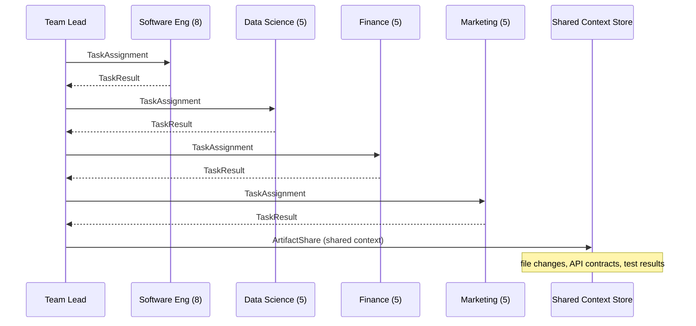

# Architecture: Provider-Agnostic Agent Orchestration

## Problem Statement

Current agent systems (Claude Code, Cursor, Copilot Workspace) are tightly coupled to a single LLM provider. This creates:

- **Vendor lock-in** — switching providers means rewriting the entire agent layer
- **No cost optimization** — can't route cheap tasks to cheap models
- **Single point of failure** — if the provider goes down, everything stops
- **No hybrid deployment** — can't mix cloud and local models

## Core Abstractions

### 1. Provider Interface

The fundamental abstraction that decouples agents from LLMs.

```python
class Provider(Protocol):
    """Any LLM backend that can generate completions."""

    async def complete(
        self,
        messages: list[Message],
        tools: list[Tool] | None = None,
        system: str | None = None,
        max_tokens: int = 4096,
    ) -> Completion: ...

    async def stream(
        self,
        messages: list[Message],
        tools: list[Tool] | None = None,
        system: str | None = None,
    ) -> AsyncIterator[StreamChunk]: ...

    @property
    def model_id(self) -> str: ...

    @property
    def capabilities(self) -> ModelCapabilities: ...
```

**Key design decision**: The interface uses a simple message-based protocol, not provider-specific features. Tool use is normalized to a common schema.

### 2. Agent

An agent is a stateless unit that receives a task, uses tools, and returns a result.

```python
@dataclass
class AgentConfig:
    name: str
    role: str                          # system prompt / persona
    provider: str                      # provider key (e.g., "claude-sonnet", "gpt-4o")
    tools: list[str]                   # allowed tool names
    max_steps: int = 10                # anti-stall: hard step limit
    max_retries_per_approach: int = 3  # anti-stall: retry cap

class Agent:
    def __init__(self, config: AgentConfig, provider: Provider, skill_registry: SkillRegistry):
        ...

    async def execute(self, task: Task) -> TaskResult:
        """Run the agent on a task. Returns structured result."""
        ...
```

**Agents are provider-parameterized** — the same agent definition can run on Claude, GPT, or a local model by swapping the provider.

### 3. Skill

A skill is a reusable, provider-independent capability that agents can invoke.

```python
class Skill(Protocol):
    """A tool/capability that agents can use."""

    @property
    def name(self) -> str: ...

    @property
    def description(self) -> str: ...

    @property
    def parameters(self) -> JsonSchema: ...

    async def execute(self, params: dict) -> SkillResult: ...
```

Skills map directly to "tools" in LLM APIs but are defined once and work across all providers.

Every tool call may include an optional `_description` parameter.  The registry
extracts it before forwarding params to the skill, logs it, and propagates it
through middleware metadata (`SkillRequest.metadata["tool_description"]`).  The
field also appears on `AuditEntry.tool_description` and in dashboard tool-call
events.  `to_tool_definitions()` injects `_description` into every schema so
LLMs can explain *why* they invoke a tool.

Examples:
- `file_read`, `file_write`, `glob_search` — filesystem operations
- `shell_exec` — run shell commands (sandboxed allowlist)
- `web_read` — fetch and extract web page content
- `github` — GitHub integration via gh CLI
- `webhook_send` — outgoing webhook notifications
- `doc_sync` — documentation sync checker
- `ask_clarification` — structured agent-human clarification (blocking/non-blocking)

### 4. Orchestrator

The orchestrator manages agent lifecycle, task routing, and resource allocation.

```python
class Orchestrator:
    def __init__(
        self,
        agents: dict[str, AgentConfig],
        providers: dict[str, Provider],
        skill_registry: SkillRegistry,
        router: TaskRouter,
    ): ...

    async def run(self, task: Task) -> OrchestratorResult:
        """Decompose task, route to agents, collect results."""
        ...
```

**Task routing strategies**:
- **Fixed** — each agent type always uses one provider
- **Cost-optimized** — route simple tasks to cheap models, complex to expensive
- **Capability-based** — match task requirements to model capabilities
- **Fallback chain** — try provider A, fall back to B on failure

### 5. Cooperation Protocol

How agents communicate when tasks span multiple domains.



**Cooperation patterns**:
- **Delegation** — team-lead assigns sub-tasks to specialists
- **Artifact sharing** — agents publish outputs (code, specs) to a shared store
- **Dependency ordering** — orchestrator ensures backend runs before frontend when needed
- **Conflict resolution** — when two agents modify the same file, team-lead resolves

### 6. Sandbox Workspace

Per-session isolated execution environment with live preview. Each session gets its own Docker container that persists for the session lifetime.

```python
class Sandbox:
    """Docker or local subprocess sandbox with resource limits and port forwarding."""
    async def start(self) -> None: ...
    async def execute(self, command: str, timeout: int | None = None) -> SandboxResult: ...
    async def write_file(self, path: str, content: str) -> None: ...
    async def read_file(self, path: str) -> str: ...
    async def get_info(self) -> SandboxInfo: ...
    async def stop(self) -> None: ...
```

**Key features**:
- **Docker mode** — runs commands in an isolated container with memory/CPU limits and optional network isolation
- **Local mode** — subprocess fallback for testing (no isolation)
- **Port forwarding** — `PortMapping` maps container ports to host ports for live preview (auto-assign or explicit)
- **Startup commands** — optional `startup_command` runs after container starts (e.g., `pip install flask`)
- **Environment variables** — inject `env_vars` into the container at creation time
- **Container introspection** — `SandboxInfo` returns status, mapped ports, uptime, resource limits
- **Path traversal protection** — validates all file paths against allowed roots, blocks `..` escapes
- **Virtual path mapping** — translates host paths to container paths
- **SandboxedShellSkill** — drop-in Skill wrapper for agent use via SkillRegistry

**SandboxManager** — session-scoped lifecycle:
- Lazy initialization on first use per session
- Configurable `max_concurrent` (default 10), LRU eviction
- **Port allocation pool** (default 9000-9099) prevents host-port collisions
- `get_sandbox_info(session_id)` returns live container metadata

**Dashboard APIs**:
- `GET /api/sandbox/status` — system overview (enabled, sessions, ports)
- `GET /api/sandbox/{id}/info` — container status, mapped ports, uptime
- `GET /api/sandbox/{id}/logs` — SSE-streamed container logs
- `DELETE /api/sandbox/{id}` — force stop and cleanup
- `WS /ws/sandbox/{id}/terminal` — interactive shell via WebSocket

**Frontend** — toggleable sandbox panel with 4 tabs:
- **Status** — container info, ports, uptime, resource usage
- **Preview** — iframe pointing to forwarded port (select port from dropdown)
- **Terminal** — WebSocket-connected interactive shell
- **Logs** — real-time log streaming

**Configuration** via environment variables:
| Variable | Default | Description |
|----------|---------|-------------|
| `SANDBOX_ENABLED` | `false` | Enable sandbox system |
| `SANDBOX_TYPE` | `docker` | `docker` or `local` |
| `SANDBOX_IMAGE` | `python:3.12-slim` | Default container image |
| `SANDBOX_TIMEOUT` | `60` | Default command timeout (seconds) |
| `SANDBOX_MEMORY` | `512m` | Container memory limit |
| `SANDBOX_MAX_CONCURRENT` | `10` | Max simultaneous containers |

## 7. DeerFlow Features (v1.2)

The following abstractions were added based on analysis of the ByteDance DeerFlow project:

- **LoopDetector** — per-session sliding window detection of repeated tool calls (warn at 3, hard stop at 5). LRU eviction at 500 sessions.
- **ToolRecovery** — detects dangling tool calls (no matching ToolMessage) and injects placeholder responses to prevent LLM state corruption.
- **Tool `_description`** — optional parameter on all skills forcing the LLM to explain WHY it's calling a tool. Logged to audit trail.
- **Progressive Skill Loading** — system prompts include compact `SkillSummary` only; agents invoke `load_skill` to fetch full instructions on demand.
- **Context Summarization** — configurable triggers (message count, token count, fraction) that auto-summarize old messages, retaining the last N verbatim.
- **OrchestratorClient** — embedded Python client for scripts/notebooks. No HTTP server needed.
- **YAML Config** — `orchestrator.yaml` with `use:` reflection pattern, env var substitution, config versioning.
- **ClarificationManager** — structured agent-human clarification (5 types, blocking/non-blocking, 5-minute timeout).
- **DocumentConverter** — converts PDF, Excel, CSV, Word, PowerPoint, HTML, text to Markdown. Graceful fallback when deps missing.
- **MemoryFilter** — sanitizes session-scoped file paths before persisting to memory/store.
- **SlackBot** — Socket Mode integration (no public IP). Thread-based conversations, category auto-detection.
- **TelegramBot** — long-polling integration. Auth via user ID whitelist, response chunking.
- **RunManager (SSE)** — HTTP SSE streaming for graph runs. HITL interrupt/resume, configurable timeout, TTL eviction, EventBus mirroring. `dashboard/sse.py`.
- **SandboxManager** — Session-scoped sandbox lifecycle with port allocation pool. Configurable max_concurrent, port range (9000-9099), container introspection. REST + WS APIs for info, logs, terminal. `dashboard/sandbox_manager.py`.
- **PostgresStore** — Durable cross-thread key-value store. JSONB values, dot-encoded namespaces, lazy TTL, UPSERT. `core/store_postgres.py`.
- **MCPClientManager** — Connect to external MCP servers (stdio/SSE). Tool discovery + injection into SkillRegistry. `core/mcp_client.py`.
- **Modular Dashboard** — `app.py` composes `gateway_api.py` (REST) + `agent_runtime_router.py` (execution/streaming). Split-process mode via `--mode gateway|runtime`.

## Mapping from Claude Code Concepts

| Claude Code | This Framework | Notes |
|-------------|---------------|-------|
| `model: sonnet/opus/haiku` | `provider: "claude-sonnet"` | Provider is explicit, not implicit |
| Agent `.md` files | `AgentConfig` YAML/Python | Richer config, same concept |
| `Agent` tool (subagent) | `orchestrator.delegate()` | Provider-agnostic delegation |
| Skills (slash commands) | `SkillRegistry` | Decoupled from any LLM |
| Hooks (PostToolUse etc.) | `EventBus` + handlers | Same pattern, more extensible |
| `CLAUDE.md` | Project config YAML | Not tied to Claude namespace |
| Memory (`MEMORY.md`) | `ContextStore` | Persistent cross-session state |

## Anti-Stall Protocol (Built Into Core)

Every agent enforces:
1. **Step limit** — configurable max steps per task (default: 10)
2. **Retry cap** — max 3 attempts per approach, then escalate
3. **Timeout** — hard wall-clock timeout per agent task
4. **Progress reporting** — agents emit progress events the orchestrator monitors
5. **Deadlock detection** — if two agents wait on each other, orchestrator breaks the cycle
