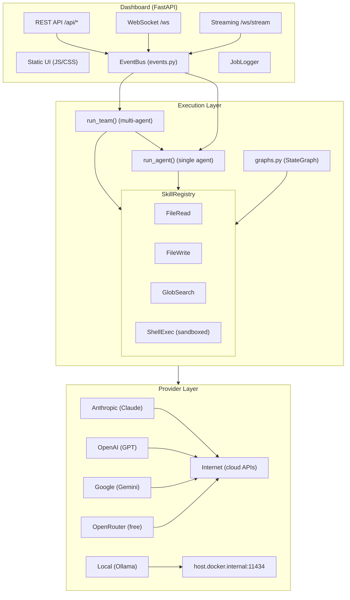
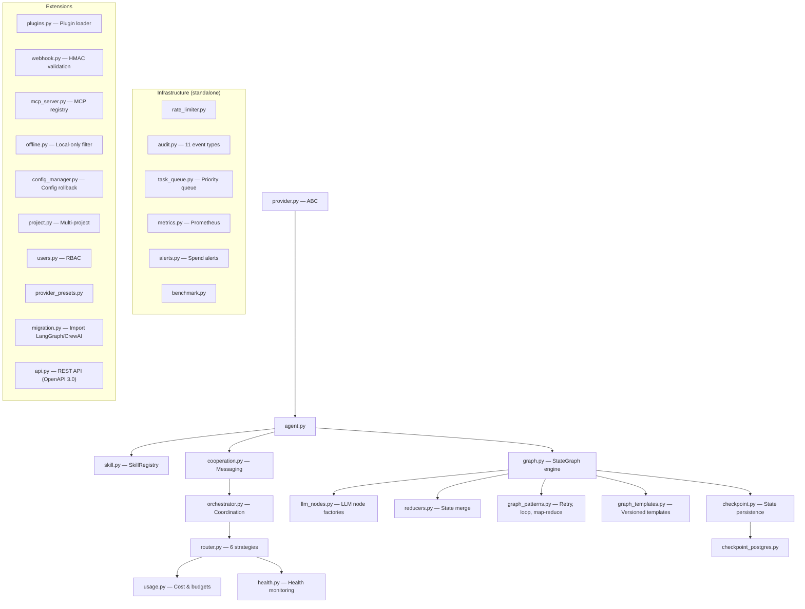
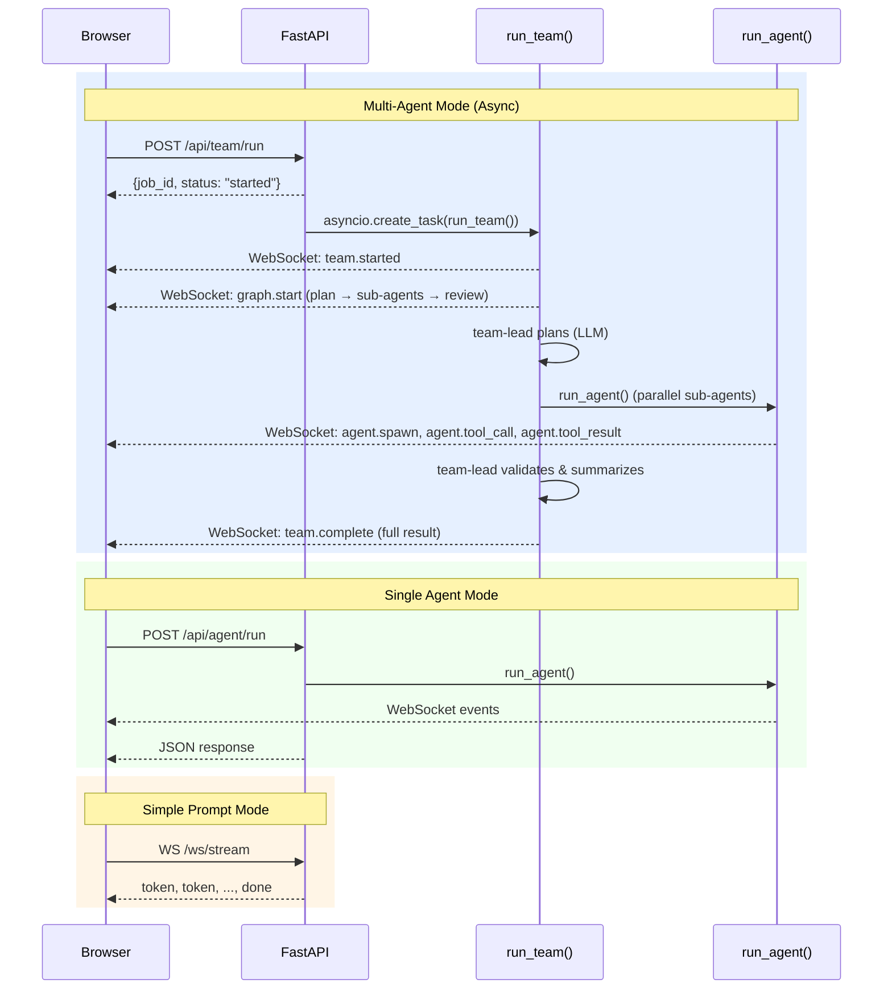
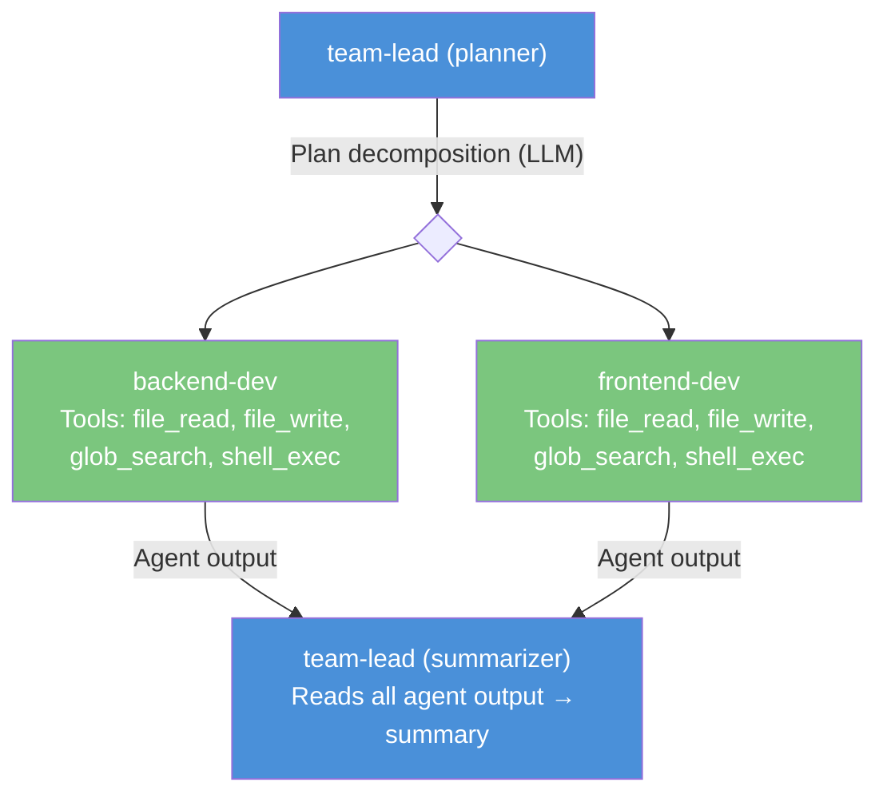
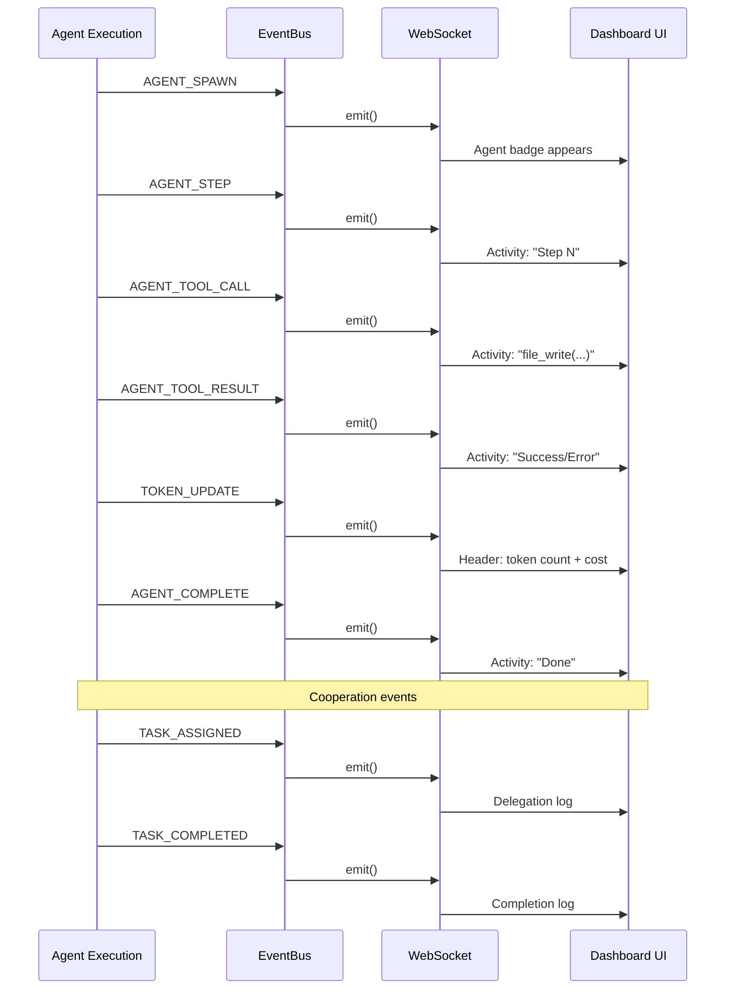

# Component Interaction Graph

## High-Level Architecture



## Core Module Interactions



## Dashboard Request Flow



## Multi-Agent Team Flow



## Event Flow (EventBus)



## File System Layout (Runtime)

```
agent-orchestrator/
├── jobs/                           # Session-based job persistence
│   ├── job_20260307_100733_a1b2/   # One folder per session
│   │   ├── 0001_prompt.json        # User prompts (logged)
│   │   ├── 0002_agent_run.json     # Agent execution results
│   │   ├── 0003_team_run.json      # Team execution results
│   │   ├── index.html              # Files created by agents
│   │   ├── style.css               │
│   │   └── app.py                  │
│   └── job_20260307_113045_c3d4/   # New session after inactivity
│       └── ...
└── src/...                         # Source code (read-only for agents)
```
