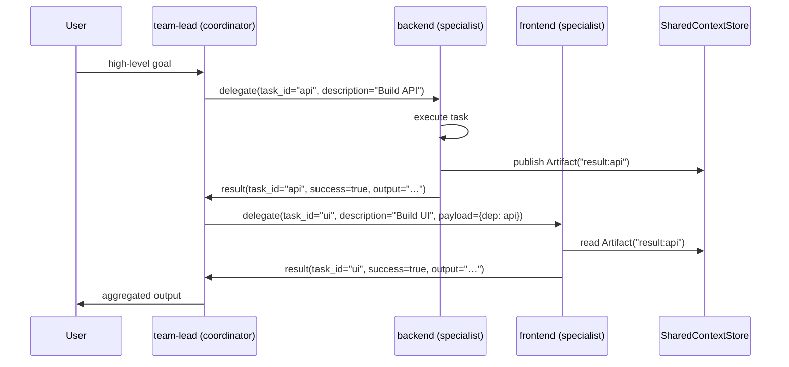
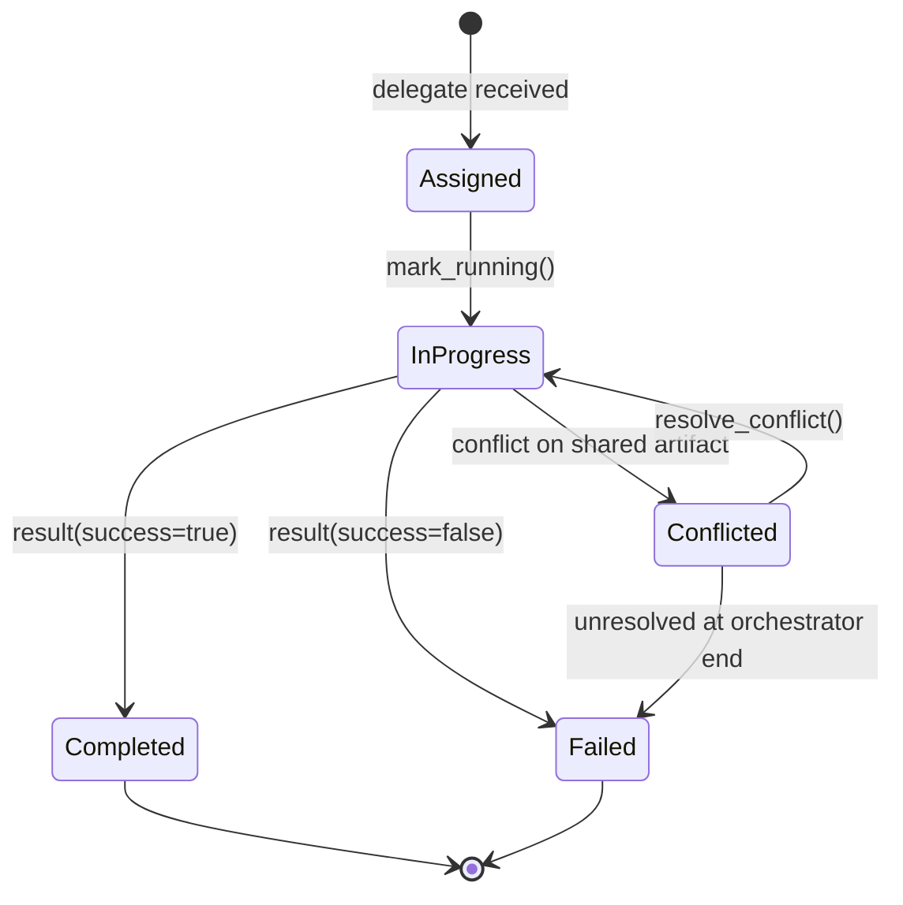

# Agent ↔ Agent Cooperation Protocol

This document is the formal spec for how agents inside the orchestrator talk
to each other. The implementation lives in
[`core/cooperation.py`](../src/agent_orchestrator/core/cooperation.py)
(in-memory state store and protocol bookkeeping) and
[`core/cooperation_messages.py`](../src/agent_orchestrator/core/cooperation_messages.py)
(typed message classes for the wire format).

It corresponds to roadmap item **P5a — tactical** in
[`analysis/harnessed-llm-agent/07-roadmap.md`](../analysis/harnessed-llm-agent/07-roadmap.md)
and [`docs/unified-roadmap.md`](unified-roadmap.md). The strategic A2A
adapter (P5b) is deferred until Google's protocol stabilises and is **not**
covered here.

## Overview

The orchestrator is a hub-and-spoke topology, not a mesh:

- A single coordinator (`team-lead`) decomposes the user request into
  sub-tasks and **delegates** each sub-task to a specialist agent.
- Specialists run their task and reply with a **result** containing the
  output, success flag, and any artifacts.
- The shared `SharedContextStore` records artifacts; if two agents publish
  the same artifact name with different `produced_by`, a **conflict** is
  raised for the coordinator to resolve.
- Optionally, before delegating, the coordinator may issue a
  **capability_query** to discover which skills a peer supports, and the
  peer answers with a **capability_response**.

Specialists do not talk directly to each other. All inter-agent traffic
flows through the coordinator and the shared store, which is what makes
the protocol auditable and replay-safe.

## Message catalogue

| `kind` | Direction | Required fields | Optional fields | Triggers next | Error semantics |
|---|---|---|---|---|---|
| `delegate` | coordinator → specialist | `task_id`, `description` | `priority`, `payload`, `to_agent` | specialist runs the task and emits `result` | unknown `to_agent` → coordinator emits a synthetic `result` with `success=false`, `error="Unknown agent"` |
| `result` | specialist → coordinator | `task_id`, `success` | `output`, `error`, `metadata` | coordinator marks task complete, may unblock dependent `delegate` messages | `success=false` keeps the task out of `_completed`; coordinator decides retry vs. fail-fast |
| `conflict` | any → coordinator | `task_id`, `reason` | `proposed_resolution` | coordinator calls `SharedContextStore.resolve_conflict()` (manual or LLM-judge) | unresolved conflicts surface in `OrchestratorResult.conflicts` |
| `capability_query` | coordinator → peer | `query` | — | peer replies with `capability_response` | timeout / no reply → coordinator falls back to fixed agent → skill mapping |
| `capability_response` | peer → coordinator | `capabilities` | — | coordinator updates its routing decision | empty list is valid (peer has no skills) |

All messages share a header: `message_id` (UUID), `from_agent`, `to_agent`
(may be `None` for broadcasts), `timestamp` (epoch seconds), and `kind`.
Frozen dataclasses guarantee header immutability after construction.

## Typical task — sequence diagram



If `backend` and `frontend` both write `shared.py`, the store raises a
`ConflictMessage` to `team-lead`, which decides whether to merge, discard,
or trigger a clarification request.

## State machine

Each `task_id` moves through a small lifecycle owned by the
`CooperationProtocol`:



- `Assigned` — task is in `_pending`, dependencies not yet satisfied or
  not yet picked up.
- `InProgress` — `mark_running()` has been called; the task is excluded
  from `get_ready_tasks()` to prevent double-dispatch.
- `Completed` / `Failed` — `complete()` moved the task into `_completed`;
  the result reflects the success flag.
- `Conflicted` — a `ConflictMessage` was raised. The task stays in
  `InProgress` until resolved or until the orchestrator finishes (in which
  case it is reported as `Failed` with conflict context).

## Error handling

| Failure | Detection | Reaction |
|---|---|---|
| Malformed message (missing `kind`) | `parse_message` raises `ValueError` | sender side: log and drop; receiver side: synthesise a `result(success=false, error=…)` |
| Unknown `kind` | `parse_message` raises `ValueError` with the list of known kinds | same — never silently accept unknown kinds |
| Unknown `to_agent` | coordinator returns `TaskResult(status=FAILED, error="Unknown agent: …")` | orchestrator emits `task.complete` with failure status |
| Specialist timeout | agent step budget exhausted (`max_steps`) | escalation to a stronger provider if `escalation_provider_key` is set; otherwise `result(success=false)` |
| Conflict | `SharedContextStore.publish` detects different `produced_by` for the same artifact name | recorded in `_conflicts`; `OrchestratorResult.conflicts` includes them |
| Deadlock (pending tasks but none ready) | `Orchestrator.run()` loop sees no ready batches and `not all_complete()` | `OrchestratorResult(success=false, output="Deadlock detected: …")` |

## Wire format and typed classes

The legacy in-memory store uses `TaskAssignment` / `TaskReport` /
`AgentMessage` / `ConflictRecord` dataclasses (see `core/cooperation.py`).
For external boundaries — MCP, dashboard SSE, audit log, future A2A — use
the typed message classes in `core/cooperation_messages.py`:

| Wire `kind` | Typed class | In-memory equivalent |
|---|---|---|
| `delegate` | `DelegateMessage` | `TaskAssignment` |
| `result` | `ResultMessage` | `TaskReport` |
| `conflict` | `ConflictMessage` | `ConflictRecord` |
| `capability_query` | `CapabilityQueryMessage` | (new — no in-memory equivalent yet) |
| `capability_response` | `CapabilityResponseMessage` | (new — no in-memory equivalent yet) |

Round-tripping is exact for documented payload fields:

```python
from agent_orchestrator.core.cooperation_messages import (
    DelegateMessage,
    parse_message,
)

msg = DelegateMessage(
    from_agent="team-lead",
    to_agent="backend",
    task_id="t1",
    description="Build API",
    priority="high",
)
d = msg.to_dict()
assert parse_message(d) == msg
```

`from_dict` is tolerant: missing optional fields fall back to their default
factories, so older callers passing partial dicts keep working. Unknown
keys are ignored. Unknown `kind` values raise a clean `ValueError`.

## Migration path

1. **Today** — `cooperation.py` operates on its in-memory dataclasses. New
   handlers added beyond this point should accept the typed messages and
   call `parse_message` at the boundary.
2. **Next** — add a thin adapter that converts `DelegateMessage` ↔
   `TaskAssignment` and `ResultMessage` ↔ `TaskReport` so the orchestrator
   can be driven entirely from typed messages.
3. **Later (P5b)** — wrap the typed messages in a Google A2A adapter once
   that protocol stabilises.
