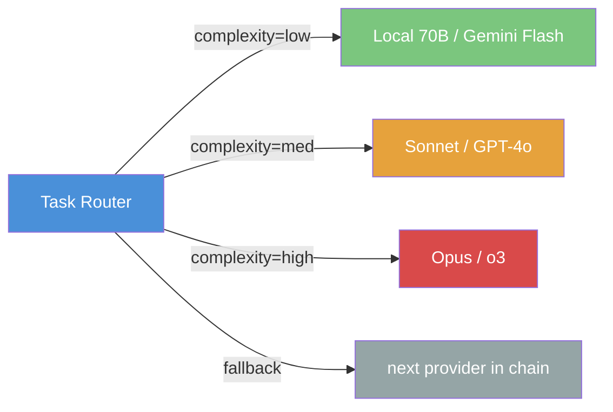

# Cost Analysis: LLM Providers for Agent Orchestration

## Provider Pricing Comparison (March 2026)

### Cloud API Providers

| Provider | Model | Input $/1M tok | Output $/1M tok | Context | Best For |
|----------|-------|----------------|-----------------|---------|----------|
| **Anthropic** | Claude Opus 4 | $15.00 | $75.00 | 200K | Complex reasoning, code gen |
| **Anthropic** | Claude Sonnet 4 | $3.00 | $15.00 | 200K | Balanced cost/quality |
| **Anthropic** | Claude Haiku 3.5 | $0.80 | $4.00 | 200K | Fast, cheap tasks |
| **OpenAI** | GPT-4o | $2.50 | $10.00 | 128K | General purpose |
| **OpenAI** | GPT-4o-mini | $0.15 | $0.60 | 128K | Bulk cheap tasks |
| **OpenAI** | o3 | $10.00 | $40.00 | 200K | Deep reasoning |
| **Google** | Gemini 2.0 Pro | $1.25 | $5.00 | 2M | Long context tasks |
| **Google** | Gemini 2.0 Flash | $0.075 | $0.30 | 1M | Ultra-cheap, fast |
| **Mistral** | Large | $2.00 | $6.00 | 128K | EU data residency |
| **DeepSeek** | V3 | $0.27 | $1.10 | 128K | Budget coding tasks |

### Local/Self-Hosted Models

| Model | VRAM Required | Quality (vs Sonnet) | Cost Model |
|-------|--------------|---------------------|------------|
| Llama 3.3 70B | 40GB (quantized) | ~80% | Hardware only |
| Qwen 2.5 72B | 40GB (quantized) | ~80% | Hardware only |
| Mixtral 8x22B | 48GB (quantized) | ~70% | Hardware only |
| DeepSeek-Coder-V2 | 24GB (quantized) | ~75% (code) | Hardware only |
| Codestral 22B | 16GB (quantized) | ~65% (code) | Hardware only |

## Cost Modeling: Agent Orchestration Scenarios

### Scenario 1: Solo Developer — 8h/day coding with agents

**Assumptions**: ~200 agent invocations/day, avg 2K input + 1K output tokens each.

| Strategy | Monthly Cost | Notes |
|----------|-------------|-------|
| All Claude Sonnet | ~$360 | Simple, high quality |
| All GPT-4o | ~$250 | Slightly cheaper |
| All Gemini Flash | ~$15 | 10-20x cheaper, quality trade-off |
| **Hybrid optimal** | **~$80** | Route by complexity (see below) |
| All local (70B) | ~$0 (+ hardware) | Need $2-3K GPU investment |

**Hybrid routing strategy**:
- 70% simple tasks (lint, format, simple edits) → Gemini Flash ($0.30/1M out)
- 20% medium tasks (feature implementation) → Sonnet/GPT-4o ($10-15/1M out)
- 10% complex tasks (architecture, debugging) → Opus/o3 ($40-75/1M out)

### Scenario 2: Team of 5 developers

| Strategy | Monthly Cost | Notes |
|----------|-------------|-------|
| All Sonnet × 5 | ~$1,800 | Straightforward but expensive |
| Hybrid × 5 | ~$400 | Good sweet spot |
| Hybrid + local for simple | ~$200 | Need one GPU server |
| Full local + cloud fallback | ~$100 + hardware | Best long-term ROI |

### Scenario 3: CI/CD pipeline agents (automated)

| Strategy | Monthly Cost | Notes |
|----------|-------------|-------|
| Cloud API per-run | Unpredictable | Spikes on heavy PR days |
| Reserved capacity | ~$500-2K | Depends on provider |
| Local GPU cluster | Hardware cost only | Predictable, but maintenance |

## Break-Even Analysis: Local vs Cloud

### When to go local

**Local GPU server (e.g., 2x RTX 4090 = ~$3,000)**:
- Can run 70B models at ~30 tok/s
- Monthly electricity: ~$30-50
- Break-even vs cloud at: **~$100/mo cloud spend** → 30 months
- Break-even vs cloud at: **~$500/mo cloud spend** → 6 months
- Break-even vs cloud at: **~$2,000/mo cloud spend** → 1.5 months

**Key factors favoring local**:
- High volume, predictable workload
- Data privacy requirements (code never leaves your network)
- Latency sensitivity (local = 0 network round-trip)
- Long-term cost savings (hardware depreciates, but so does cloud spending)

**Key factors favoring cloud**:
- Access to frontier models (Opus, o3) — no local equivalent
- No hardware maintenance burden
- Elastic scaling (burst capacity)
- Always latest models without upgrade cycles

### Recommendation: Hybrid Architecture

This gives you:
- **60-80% cost reduction** vs all-cloud frontier models
- **Graceful degradation** if a provider is down
- **Data control** for sensitive code (routed to local)
- **Best quality** for the tasks that need it

## Token Optimization Strategies

1. **Context pruning** — don't send full file contents, only relevant snippets
2. **Caching** — reuse completions for identical or near-identical prompts
3. **Prompt compression** — strip comments, minimize system prompts for simple tasks
4. **Batching** — group related simple tasks into one API call
5. **Streaming** — cancel early if the first tokens indicate a wrong approach
6. **RTK-style filtering** — filter tool output before it enters the context (60-90% savings)
