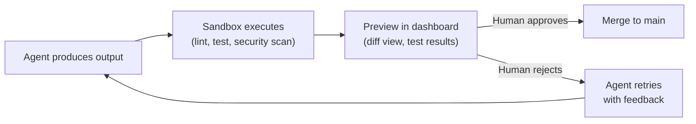
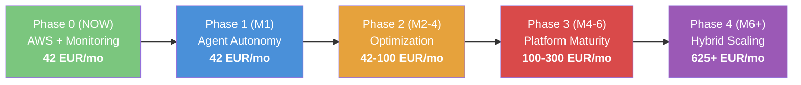

# Roadmap — Agent Orchestrator

**Unified Technical & Business Plan**
*Updated: March 2026*

---

## Current State (near-MVP)

**What's built:**
- StateGraph engine (parallel execution, conditional routing, HITL, checkpointing)
- 5 LLM providers: Anthropic, OpenAI, Google, OpenRouter (free models), Local/Ollama
- LLM node factories (`llm_node`, `multi_provider_node`, `chat_node`)
- Interactive dashboard (FastAPI + WebSocket, streaming, model selector, graph visualization)
- Core abstractions: Provider, Agent, Skill, Orchestrator, Cooperation
- 23 agents across 5 categories (software-engineering, data-science, finance, marketing, tooling)
- SkillKit scout agent for marketplace skill discovery (15,000+ skills)
- Per-agent cost tracking, fallback chains, budget enforcement
- OrbStack/Docker infrastructure (dashboard, postgres, test, lint, format)
- 487+ tests, pre-commit hooks, CI pipeline

**What's missing for production:**
- No cloud deployment (runs only locally)
- No infrastructure monitoring (Prometheus, Grafana)
- No sandbox for testing agent output (preview before merge)
- No autonomous agent workflow validation
- No revenue model or public API

---

## URGENT: Phase 0 — AWS Infrastructure + Auth (ASAP)

**Goal:** EC2 up, HTTPS working, OAuth2 active, first agent reachable remotely.
**Budget:** ~42 EUR/month
**Duration:** 2 sprints (2 weeks)

> **IaC:** Terraform · **CI/CD:** GitHub Actions · **Cloud:** AWS EC2 + Docker Compose
> **Auth:** OAuth2 (Google/GitHub) + JWT session cookies · **State:** S3 + DynamoDB lock

### Architecture Target

```
Internet
   │
   ▼
Route53 (DNS) ──► ACM (SSL cert)
   │
   ▼
EC2 t3.medium (Elastic IP + Security Group)
   │
   Docker Compose
   ├── Nginx (reverse proxy + SSL termination)
   │     └── /          → Dashboard (FastAPI + static UI)
   │     └── /api/      → FastAPI (orchestrator API)
   │     └── /auth/     → OAuth2 callback handler
   ├── FastAPI + StateGraph (multi-agent orchestrator)
   ├── PostgreSQL (checkpoints, usage data)
   ├── Redis (semantic cache + session store)
   ├── Prometheus (metrics collection)
   ├── Grafana (visualization, alerts)
   └── Node Exporter (system metrics)
   │
   ▼
OpenRouter API (free models + fallback chains)
```

### Prerequisites

- [ ] AWS account with dedicated IAM user (not root): EC2, S3, DynamoDB, IAM, Route53
- [ ] AWS CLI configured locally (`aws configure`)
- [ ] Terraform installed (`brew install terraform`)
- [ ] GitHub Secrets configured:
  ```
  AWS_ACCESS_KEY_ID, AWS_SECRET_ACCESS_KEY, AWS_REGION
  EC2_SSH_PRIVATE_KEY
  OPENROUTER_API_KEY          ← already configured ✓
  GOOGLE_CLIENT_ID            ← from Google Cloud Console
  GOOGLE_CLIENT_SECRET
  GITHUB_OAUTH_CLIENT_ID      ← from GitHub Developer Settings
  GITHUB_OAUTH_CLIENT_SECRET
  JWT_SECRET_KEY              ← random 256-bit string
  ```
- [ ] Domain registered (e.g. `agents.yourdomain.com`)
- [ ] Google Cloud Console: OAuth2 app + redirect URI `https://agents.yourdomain.com/auth/google/callback`
- [ ] GitHub Developer Settings: OAuth App + redirect URI `https://agents.yourdomain.com/auth/github/callback`

### Sprint 1 — Terraform: Bootstrap AWS Infrastructure

#### Step 1.1 — Terraform Backend (S3 + DynamoDB)

One-time manual bootstrap:

```bash
# S3 bucket for state
aws s3api create-bucket \
  --bucket ai-agents-terraform-state \
  --region eu-west-1 \
  --create-bucket-configuration LocationConstraint=eu-west-1

aws s3api put-bucket-versioning \
  --bucket ai-agents-terraform-state \
  --versioning-configuration Status=Enabled

# DynamoDB table for lock
aws dynamodb create-table \
  --table-name terraform-state-lock \
  --attribute-definitions AttributeName=LockID,AttributeType=S \
  --key-schema AttributeName=LockID,KeyType=HASH \
  --billing-mode PAY_PER_REQUEST \
  --region eu-west-1
```

Files to create: `terraform/backend.tf`, `terraform/main.tf`, `terraform/variables.tf`, `terraform/outputs.tf`

#### Step 1.2 — VPC + EC2 + Security Group

Terraform modules: `terraform/modules/ec2/`, `terraform/modules/networking/`, `terraform/modules/iam/`

Key resources:
- Security group: SSH (your IP only), HTTP 80, HTTPS 443
- EC2 `t3.medium`, Ubuntu 24.04, 30GB gp3
- Elastic IP for stable address
- User data script: install Docker + docker-compose

#### Step 1.3 — GitHub Actions: Terraform Pipeline

File: `.github/workflows/terraform.yml`
- Trigger on push to `main` (paths: `terraform/**`)
- Steps: checkout → AWS credentials → terraform init/plan/apply

**Sprint 1 Deliverables:**
- [ ] S3 bucket + DynamoDB created manually
- [ ] `terraform apply` creates EC2, SG, EIP without errors
- [ ] SSH to EC2 working, Docker installed
- [ ] GitHub Actions runs plan/apply on push

### Sprint 2 — Auth OAuth2 + App Deploy + Monitoring

#### Step 2.1 — OAuth2 Authentication

OAuth2 flow with JWT session cookies:

```
Browser → GET /auth/google → redirect to Google
Google  → GET /auth/google/callback?code=xxx
FastAPI → exchange code → get user info → create JWT session cookie
Browser → all /api/* requests use JWT cookie
```

Implementation: `authlib` for OAuth2 + `PyJWT` for session tokens.
Middleware: `get_current_user` dependency on all protected endpoints.

Security:
- JWT cookie: `httponly=True`, `secure=True`, `samesite=lax`
- Rate limiting on `/api/*` (max 60 req/min per user)

#### Step 2.2 — Docker Compose Production

File: `docker-compose.prod.yml`
- nginx (reverse proxy + SSL termination)
- backend (FastAPI orchestrator)
- redis (semantic cache + sessions)
- postgres (checkpoints, usage)
- prometheus + grafana (monitoring)

#### Step 2.3 — GitHub Actions: Deploy Pipeline

File: `.github/workflows/deploy.yml`
- Trigger on push to `main` (paths: `backend/**`, `docker-compose.prod.yml`, `nginx/**`)
- Steps: get EC2 IP from Terraform → SSH deploy → health check (`/health`)

#### Step 2.4 — SSL with Let's Encrypt

One-time on EC2:
```bash
sudo apt install certbot -y
sudo certbot certonly --standalone -d agents.yourdomain.com --agree-tos --non-interactive
echo "0 12 * * * certbot renew --quiet" | sudo crontab -
```

#### Step 2.5 — Monitoring Board

| Task | Priority | Detail |
|------|----------|--------|
| Prometheus setup | CRITICAL | Scrape orchestrator metrics (`/metrics` endpoint) |
| Grafana dashboards | CRITICAL | Agent activity, latency, token usage, cost per model |
| Node Exporter | HIGH | EC2 system metrics (CPU, RAM, disk, network) |
| Alert rules | HIGH | Cost threshold, error rate spike, agent stall detection |
| CloudWatch basics | MEDIUM | EC2 auto-recovery, uptime monitoring |

**Sprint 2 Deliverables:**
- [ ] OAuth2 Google + GitHub working
- [ ] Dashboard accessible only after login
- [ ] Streaming agent responses in UI
- [ ] GitHub Actions auto-deploys on push to `main`
- [ ] HTTPS active on custom domain
- [ ] Grafana accessible via SSH tunnel (`ssh -L 3001:localhost:3001 ubuntu@ec2-ip`)
- [ ] Prometheus scraping orchestrator metrics

### Phase 0 KPIs

| KPI | Target |
|-----|--------|
| Deploy time (push → live) | < 5 min |
| Auth success rate | 100% |
| First token latency | < 5s |
| Uptime | 99% |
| Monthly infra cost | < 60 EUR |

### Security Checklist

- [ ] SSH open only from your fixed IP (Terraform SG)
- [ ] Grafana not publicly exposed (SSH tunnel only)
- [ ] `.env.prod` never in repository (GitHub Secrets only)
- [ ] JWT cookie `httponly=True`, `secure=True`, `samesite=lax`
- [ ] Rate limiting on `/api/*` (max 60 req/min per user)
- [ ] OpenRouter API key rotated every 90 days
- [ ] AWS IAM: EC2 uses Instance Role (no hardcoded credentials)
- [ ] S3 state bucket: access restricted to CI/CD IAM user

---

## Phase 1: Agent Autonomy Lab (Month 1)

**Goal:** Understand how agents actually perform, test their output safely, build confidence in autonomous execution.

### 1A — Agent Output Sandbox (Preview & Test)

| Task | Detail |
|------|--------|
| E2B or Docker sandbox | Isolated environment where agents run code before it touches real files |
| Output preview | Agent generates code/changes → preview diff → human approves or rejects |
| Auto-validation pipeline | Lint + test + security scan on every agent output before merge |
| Artifact staging | Agent output goes to a staging branch/directory, not directly to main |
| Dashboard integration | Show preview diffs in the dashboard UI, approve/reject with one click |

**Flow:**



### 1B — Agile Team Experiment

| Task | Detail |
|------|--------|
| Sprint simulation | Give agents a backlog of tasks, see what they can deliver in a "sprint" |
| Team-lead as Scrum Master | Team-lead decomposes epics into stories, assigns to agents |
| Velocity tracking | Measure: tasks completed, quality score, rework rate |
| Autonomy levels | L1: human approves everything, L2: auto-merge if tests pass, L3: full autonomy |
| Retrospective data | What tasks agents handle well vs. where they fail |

### 1C — Agent Behavior Observability

| Task | Detail |
|------|--------|
| LangFuse integration | Trace every LLM call: prompt, response, latency, tokens, cost |
| Agent decision log | Why did team-lead route to agent X? Why did agent choose approach Y? |
| Failure analysis | Categorize failures: wrong approach, hallucination, tool misuse, timeout |
| Quality scoring | Auto-score agent output: does it compile? pass tests? follow conventions? |

### KPIs

- Sandbox preview working end-to-end
- First "sprint" completed with measurable velocity
- Agent success rate measured per category
- Clear data on which tasks agents handle autonomously vs. need human help

---

## Phase 2: Optimization & First Revenue (Month 2-4)

**Goal:** Semantic cache, smart routing, multi-agent workflows, beta users.
**Budget:** 60-100 EUR/month

### Sprint 3 — Semantic Cache + Monitoring

- [ ] Redis semantic cache (hash prompt → response, TTL 24h)
- [ ] Smart model routing by task complexity:
  ```python
  def select_model(task: str, context_length: int) -> str:
      if context_length > 16000 or needs_reasoning(task):
          return "high_quality_model"    # complex tasks
      return "fast_cheap_model"          # simple tasks
  ```
- [ ] Alert on OpenRouter daily spend > threshold (Telegram/email)
- [ ] Grafana dashboards: token/hour, cost/user, latency p95

### Sprint 4 — Multi-Agent Workflow

- [ ] Supervisor agent (StateGraph) routes tasks to specialized agents
- [ ] At least 2 workflows: `researcher` (analysis) + `executor` (actions/output)
- [ ] Shared memory Redis between agents (cross-agent state)
- [ ] Tool integration: web search or external API

### Sprint 5 — Beta Users + Revenue

- [ ] Multi-user management: each user sees only their own history
- [ ] Usage quota per user (configurable, hard limit)
- [ ] Onboard 3-5 beta testers
- [ ] Structured feedback collection
- [ ] Pricing model: Free (limited), Pro (higher limits), Enterprise
- [ ] Landing page + Stripe payment integration

### KPIs

| KPI | Target |
|-----|--------|
| Cache hit rate | > 20% |
| Cost per request | < $0.02 |
| Latency first token | < 3s |
| Monthly revenue | > 100 EUR |
| Active beta users | 5+ |

---

## Phase 3: Platform Maturity (Month 4-6)

**Goal:** Solidify the platform, expand provider support, prepare for scaling.
**Budget:** 100-300 EUR/month

### 3A — Framework Hardening

| Task | Detail |
|------|--------|
| Agent persistence | Save/resume long-running agent sessions across restarts |
| Skill marketplace | Users can publish and share custom skills |
| Graph versioning | Version and rollback graph definitions |
| Advanced observability | Distributed tracing, per-agent performance dashboards |

### 3B — Advanced Features

| Task | Detail |
|------|--------|
| Full agile team mode | Agents run sprints autonomously with human review at end |
| Conflict resolution | When agents modify same resources, auto-resolve or escalate |
| Human-in-the-loop flows | Production-grade approval steps in graphs |
| Fine-tuning pipeline design | Document the approach, prepare data collection |

### 3C — Provider Expansion

| Task | Detail |
|------|--------|
| Mistral provider | EU data residency option |
| DeepSeek provider | Budget coding alternative |
| Multi-provider node | Production routing across all providers based on cost/capability |

### KPIs

- Monthly revenue > 300 EUR
- Zero-downtime deploys
- Autonomous sprint velocity > 60% of human baseline
- 20+ active users

---

## Phase 4: Hybrid Scaling (Month 6+)

**Trigger:** Monthly revenue > 600 EUR for 2 consecutive months.
**Budget:** ~625 EUR/month

### Sprint 6 — Vast.ai Integration

- [ ] WireGuard tunnel between EC2 and Vast.ai instances (secure private IP)
- [ ] Deploy vLLM + quantized model on GPU instances
- [ ] Terraform/bash scripts for Vast.ai provisioning via API
- [ ] Health check: if Vast.ai unresponsive → automatic failover to OpenRouter

**Architecture:**

```
EC2 AWS (Orchestrator) ←──WireGuard VPN──► Vast.ai GPU #1 (vLLM)
         │                                ──► Vast.ai GPU #2 (vLLM)
         │
         └──► OpenRouter (fallback if Vast.ai down)
```

### Sprint 7 — Smart Hybrid Router

```python
async def smart_route(request) -> str:
    if await vastai_healthy() and not request.urgent:
        return "vastai"           # $0 marginal cost
    elif request.complexity == "high":
        return "openrouter_high"  # quality fallback
    return "openrouter_cheap"     # economy fallback
```

- [ ] Load balancing across GPU instances
- [ ] Metrics: % requests served by Vast.ai vs OpenRouter
- [ ] Alert if Vast.ai down > 30 minutes (interruptible = normal)

### 4B — Fine-Tuning

| Task | Detail |
|------|--------|
| Data pipeline | Collect and curate training data from production usage |
| Fine-tune Qwen3 30B | Domain-specific fine-tuning on H200 |
| A/B testing | Compare fine-tuned vs base model on real traffic |
| Model registry | Track model versions, metrics, rollback capability |

### 4C — Enterprise Features

| Task | Detail |
|------|--------|
| SSO / SAML | Enterprise authentication |
| Audit logging | Full audit trail of all agent actions |
| Data residency | Choose where data is processed (EU, US, self-hosted) |
| SLA guarantees | Defined uptime and latency commitments |
| On-prem option | Package for customer self-hosting |

### Cost Breakdown (Phase 4)

| Item | EUR/month |
|------|-----------|
| AWS EC2 + S3 + networking | 80 |
| Vast.ai H200 interruptible (252h/month inference) | 305 |
| Vast.ai H200 on-demand (108h/month fine-tuning) | 241 |
| OpenRouter (overflow/fallback) | 30 est. |
| **Total** | **~656** |

### KPIs

- Monthly revenue > 1,000 EUR
- Fine-tuned model outperforms base on domain tasks
- Self-hosted inference latency < cloud API
- Enterprise pipeline started

---

## v1.1 — LangGraph-Inspired Improvements

**Goal:** Adopt key patterns from LangGraph analysis to harden the orchestrator before scaling.
**Reference:** [`analysis/langgraph/`](../analysis/langgraph/) — 30-file deep analysis of LangGraph internals.
**Source files:** [28-comparison](../analysis/langgraph/28-comparison.md), [29-lessons-learned](../analysis/langgraph/29-lessons-learned.md)

### Sprint 1: State & Caching

| Task | Inspired By | Priority | Detail |
|------|------------|----------|--------|
| Channel-based state with reducers | [03-channels](../analysis/langgraph/03-channels.md) | High | Typed channels per state field. `LastValue` (single writer), `BinaryOperatorAggregate` (reducer fold), `Topic` (append). Solves concurrent agent writes to shared state. |
| Task-level result caching | [15-cache](../analysis/langgraph/15-cache.md) | High | Cache skill/node results by input hash. `CachePolicy` per skill. InMemory first, Redis later. Skip re-execution on cache hit. |
| Conformance test suite | [16-conformance-tests](../analysis/langgraph/16-conformance-tests.md) | High | Capability-based test harness for Provider and Checkpoint interfaces. Any new implementation runs against it automatically. |

### Sprint 2: HITL & Memory

| Task | Inspired By | Priority | Detail |
|------|------------|----------|--------|
| Interrupt/resume (HITL) | [19-human-in-the-loop](../analysis/langgraph/19-human-in-the-loop.md) | High | `interrupt()` pauses graph, persists state. `Command(resume=value)` continues. Interrupt is control flow, not an error. Required for production approval workflows. |
| Store abstraction (cross-agent memory) | [14-store](../analysis/langgraph/14-store.md) | High | Separate from checkpoints. `BaseStore` with `get/put/search/delete`. Namespace-based hierarchy. Cross-thread persistent memory (user profiles, knowledge base). |
| Skill middleware pattern | [18-tool-node](../analysis/langgraph/18-tool-node.md) | Medium | `SkillWrapper(request, next_fn) -> result`. Enables retry, caching, logging, authorization as composable middleware on skill execution. |

### Sprint 3: Persistence & Streaming

| Task | Inspired By | Priority | Detail |
|------|------------|----------|--------|
| Content-addressed checkpoint blobs | [13-checkpoint-postgres](../analysis/langgraph/13-checkpoint-postgres.md) | Medium | Split complex values into `checkpoint_blobs` table keyed by `(thread, ns, channel, version)`. `ON CONFLICT DO NOTHING` — same blob never re-written. Massive storage savings. |
| Anti-stall via managed values | [09-managed-values](../analysis/langgraph/09-managed-values.md) | Medium | Inject `RemainingSteps` / `IsLastStep` into agents. Graceful degradation instead of hard recursion limit errors. |
| Encrypted serialization | [11-checkpoint-serialization](../analysis/langgraph/11-checkpoint-serialization.md) | Low | Optional AES encryption for checkpoint blobs. Required for sensitive data at rest. |
| SSE streaming improvements | [27-streaming](../analysis/langgraph/27-streaming.md) | Low | Add `stream_mode` support (values/updates/messages/debug). SSE reconnection with `Last-Event-ID`. |

### v1.1 KPIs

- Channel-based state operational with reducer tests
- HITL interrupt/resume working end-to-end
- Conformance suite passing for all providers and checkpointers
- Task caching reducing redundant LLM calls by 30%+
- Store abstraction with namespace-based cross-agent memory

---

## Growth Opportunities (Suggestions)

These are high-potential features that could accelerate product growth, based on market trends in the AI agent orchestration space ($8.5B market in 2026).

### 1. Agent-as-a-Service API

Expose agents via a public REST API. Users send a task, get back structured results. No need to self-host. This is the fastest path to recurring revenue.

```
POST /api/v1/tasks
{ "task": "Review this PR for security issues", "context": { "repo": "...", "pr": 42 } }
→ { "result": "...", "agent": "backend", "cost": 0.003 }
```

### 2. Vertical Agent Packs (Niche Monetization)

Package domain-specific agent teams as paid add-ons:
- **SaaS Startup Pack**: backend + frontend + devops agents pre-configured for common stacks
- **Data Analytics Pack**: data-analyst + ml-engineer + bi-analyst for business intelligence
- **Compliance Pack**: compliance-officer + accountant for regulated industries

The market shows that **niche, domain-specific agent solutions** monetize far better than general-purpose frameworks.

### 3. SkillKit Marketplace Integration (Two-Way)

Not just consume skills from SkillKit — **publish** your agents' skills back. This creates a flywheel: more users → more skills → more users.

### 4. GitHub App / CI Integration

An agent that runs on every PR: reviews code, suggests improvements, checks for security issues. This is the most natural entry point for developer teams. Similar to what Codex and Claude Code do, but with your multi-agent approach.

### 5. Local-First + Cloud Burst Model

Sell the "privacy story": agents run locally by default (Ollama), burst to cloud only when needed. This is a strong differentiator vs. pure-cloud solutions like LangGraph Cloud.

---

## Financial Summary



### Break-Even Analysis

- **Phase 0-1:** Infrastructure investment, no revenue yet
- **Phase 2:** Profitable at ~5 paying users (10 EUR/month each)
- **Phase 3:** Profitable at ~15 paying users or 2-3 Pro users (100 EUR/month)
- **Phase 4:** Self-hosted GPU pays for itself when OpenRouter spend would exceed 545 EUR/month

---

## Risk Management

| Risk | Probability | Impact | Mitigation |
|------|-------------|--------|------------|
| OpenRouter price increase | Medium | Medium | Multi-provider routing, DashScope fallback |
| OpenRouter rate limits | Low | High | Aggressive caching, tier upgrade |
| Vast.ai interruption (Phase 4) | Medium | Medium | OpenRouter as automatic fallback |
| Token costs out of control | Medium | High | Hard budget cap, alerts, prompt caching |
| EC2 downtime | Low | High | CloudWatch auto-recovery + Prometheus alerts |
| Low user adoption | Medium | High | Iterate on use cases, pivot pricing, open-source core |
| Provider API breaking changes | Medium | Medium | Provider abstraction layer isolates impact |
| Agent output quality too low | Medium | High | Sandbox + auto-validation catches bad output before merge |
| 40% agentic projects cancelled industry-wide | High | Medium | Focus on measurable ROI, start with proven use cases |

---

## Monitoring Stack

### Phase 0 (Immediate)

- **Prometheus**: scrape `/metrics` endpoint, agent execution metrics
- **Grafana**: real-time dashboards (agent activity, cost, latency, error rates)
- **Node Exporter**: EC2 system metrics (CPU, RAM, disk)
- **Alert Manager**: cost threshold, error spike, stall detection → Telegram/email

### Phase 1 (Month 1)

- **LangFuse**: LLM tracing, prompt versioning, evaluation scores
- **Agent decision log**: structured JSON log of routing decisions
- **Quality metrics**: compile rate, test pass rate, convention adherence per agent

### Phase 3-4 (Complete)

- Vast.ai dashboard: GPU utilization, instance uptime
- Custom analytics: per-user cost, graph execution stats, sprint velocity

---

## Full Technology Stack

| Layer | Technology |
|-------|------------|
| IaC | Terraform 1.7+ |
| CI/CD | GitHub Actions |
| Cloud | AWS EC2 t3.medium (eu-west-1) |
| State | S3 + DynamoDB lock |
| Container | Docker + Compose (OrbStack locally) |
| Reverse proxy | Nginx + Let's Encrypt |
| Auth | OAuth2 Google/GitHub + JWT cookie (Phase 0) → SSO/SAML (Phase 4) |
| Backend | FastAPI + StateGraph engine |
| Cache | Redis 7 (semantic cache + sessions) |
| Database | PostgreSQL (checkpoints, usage) |
| Monitoring | Prometheus + Grafana + Node Exporter |
| LLM Phase 0-2 | OpenRouter (free models + fallback chains) |
| LLM Phase 3+ | vLLM on Vast.ai GPU + OpenRouter fallback |

## Immediate Next Steps (This Week)

1. **Terraform bootstrap** — S3 state bucket + DynamoDB lock table
2. **Terraform modules** — VPC, EC2, security groups, Elastic IP
3. **GitHub Actions** — Terraform plan/apply + app deploy pipelines
4. **OAuth2 auth** — Google/GitHub login with JWT session cookies
5. **Production Docker config** — `docker-compose.prod.yml` with nginx, HTTPS, Redis, Prometheus, Grafana
6. **Deploy to EC2** — push current codebase, verify dashboard works remotely
7. **Grafana dashboards** — agent metrics, cost tracking, system health

---

*Document created: March 2026 — last updated: March 2026*
