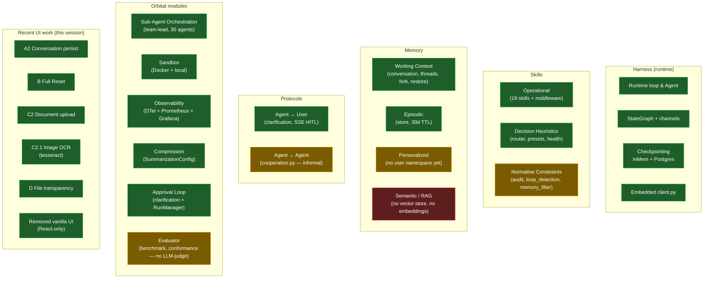
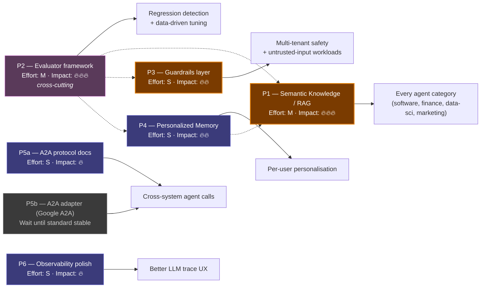
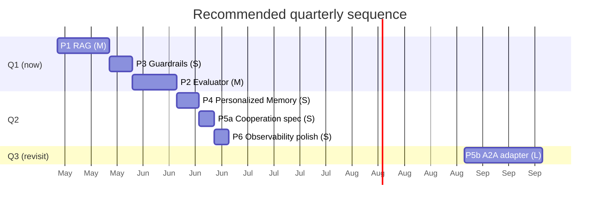

# Unified Roadmap — Agent Orchestrator

**Source of truth for "what's done, what's next, why."**
Consolidates the 5 deep-dive analyses under `analysis/` (deepflow, langgraph, paperclip, llm-use, harnessed-llm-agent) and the canonical `docs/roadmap.md` into a single dependency-aware view.

This file replaces fragmented per-analysis roadmaps for prioritisation purposes; the per-analysis files remain as research notes.

---

## TL;DR

- **Coverage of the harnessed-LLM-agent reference model**: ~82 % (13 of 19 components ✅, 5 ⚠️, 1 ❌).
- **Most older improvements** (loop detection, embedded client, channels, conformance tests, HITL, summarisation, store abstraction, skill middleware, sandbox, document upload, OCR) are **already implemented**.
- **Single biggest gap**: **Semantic Knowledge / RAG** — the only ❌ in the matrix. It is the multiplier for *every* agent category, not just Simple Prompt.
- **Next 3 features (recommended order)**: P1 RAG → P3 Guardrails → P2 Evaluator. P2/P3 do **not** depend on P1; they're sequenced by ROI, not by prerequisite.

---

## Why RAG matters for every execution mode

A common misconception is that retrieval is only useful for "Simple Prompt" Q&A over an attached document. The truth is the opposite — RAG benefits **scale with agent complexity**:

| Mode | RAG benefit | Why |
|---|---|---|
| **Simple Prompt** | Low–Medium | A single file already fits via `file_context`. RAG kicks in only when content > context window. |
| **Single Agent** | **High** | Tool-using agents (code-reviewer, security-auditor, …) can call `retrieve(query)` to fetch only the relevant chunks instead of stuffing the whole repo into the prompt. |
| **Multi-Agent** | **Very High** | Per-agent and shared knowledge namespaces let team-lead delegate without manual context plumbing — each sub-agent pulls what it needs from its own namespace. |

The P1 design uses three namespaces: `("agent", name)`, `("shared",)`, `("user", id)`. The same store powers per-agent expertise, organisation-wide policy docs, and personalised memory (P4).

---

## Status snapshot (today)

Legend: green = ✅ done, yellow = ⚠️ partial, red = ❌ missing.

---

## Improvement graph (where we go next)

P1–P6 are the priorities from `analysis/harnessed-llm-agent/07-roadmap.md`. Arrows show **enabling relationships**, not strict prerequisites — every node can be built independently.

**Reading the graph:**

- Solid arrows = "this priority unlocks/produces this benefit".
- Dotted arrows = "P2 *measures* the quality of these other priorities" (cross-cutting, not a hard prerequisite).
- P4 dotted-arrow into P1 = personalised memory becomes meaningful only when you can retrieve from it (which is the same `KnowledgeStore` infrastructure as P1).

---

## Priority cards

### P1 — Semantic Knowledge / RAG  🔥🔥🔥

| | |
|---|---|
| **Effort** | M (1–2 weeks) |
| **Risk** | Low (additive; no existing feature depends on it) |
| **Source** | `analysis/harnessed-llm-agent/07-roadmap.md` §P1 |
| **Status** | ❌ Not started |

**What it adds**
- `core/knowledge.py`: `EmbeddingProvider` ABC + `OpenAIEmbeddings`, `LocalEmbeddings`, `ClaudeEmbeddings`; `KnowledgeStore` ABC + `PgVectorStore` impl; namespaces `("agent", name)`, `("shared",)`, `("user", id)`.
- `skills/retrieval_skill.py`: `retrieve(query, namespace, k=5)` tool wired into the skill middleware chain.
- Ingestion pipeline: existing `core/document_converter.py` → chunks → embeddings → store.
- API: `POST /api/knowledge/ingest`, `POST /api/knowledge/search`, `GET /api/knowledge/namespaces`.
- Dashboard: knowledge tab — list namespaces, upload docs, test retrieval.

**Benefits**
- Unlocks **every agent category**: code-reviewer searches the codebase, finance pulls filings, data-scientist looks up schemas, marketer queries brand docs.
- Removes the context-window ceiling that today caps how much an agent can "know about" a project.
- Combined with P4 namespaces, gives per-user personalisation for free.

**Reference repos**: `pgvector/pgvector`, `run-llama/llama_index`, `chroma-core/chroma`.

---

### P2 — Evaluator framework  🔥🔥🔥  *(cross-cutting)*

| | |
|---|---|
| **Effort** | M |
| **Risk** | Low (new subsystem, opt-in in CI) |
| **Source** | `analysis/harnessed-llm-agent/07-roadmap.md` §P2 |
| **Status** | ⚠️ Partial — `core/benchmark.py`, `conformance.py`, `smoke_tester.py` exist but no LLM-judge, no datasets, no CI gate. |

**What it adds**
- `core/evaluator.py`: `Evaluator` ABC, `LLMJudge`, `RubricEvaluator` (regex / contains / JSON schema / length), `EvalSuite`.
- `evals/` directory with YAML/JSON golden datasets and CLI runners.
- API + dashboard tab: score-over-time, side-by-side diffs.
- CI: GitHub Action that runs a smoke eval on every PR; fail if any metric regresses > 5 %.

**Benefits**
- Closes the feedback loop. Without it, P1 retrieval quality, P3 false-positive rate, prompt-tuning experiments, model swaps — **all are blind flights**.
- Makes "did this PR make the agent smarter or dumber?" a yes/no answer.

**Why labelled cross-cutting**: P2 is independent of P1/P3/P4 to *build*, but it MEASURES them. You can ship it before, after, or in parallel with the others; the impact compounds.

**Reference repos**: `openai/evals`, `confident-ai/deepeval` (pytest-friendly, drop-in), `explodinggradients/ragas` (best paired with P1).

---

### P3 — Guardrails layer  🔥🔥

| | |
|---|---|
| **Effort** | S (< 1 week) |
| **Risk** | Medium (wraps `Agent.execute()`) |
| **Source** | `analysis/harnessed-llm-agent/07-roadmap.md` §P3 |
| **Status** | ⚠️ Partial — input/output filtering exists in `audit.py`, `loop_detection.py`, `memory_filter.py`, but no unified pre/post layer. |

**What it adds**
- `core/guardrails.py`: `Guardrail` ABC + `GuardrailManager` + built-ins:
  - `PIIScanner`, `SecretsScanner`, `PromptInjectionDetector`, `OutputSchemaGuard`, `CostGuard`.
- Integration in `Agent.execute()`: pre-LLM input check, post-LLM output check, `guardrail.blocked` event.
- YAML config per-agent.

**Benefits**
- Required for **multi-tenant** deployment or **untrusted user input** in any production scenario.
- Cheap to add now (S effort), painful to retrofit once agents are wired into customer paths.
- Independent of P1: deploy as soon as the team has a free week.

**Reference repos**: `guardrails-ai/guardrails`, `NVIDIA/NeMo-Guardrails`, `protectai/llm-guard`.

---

### P4 — Personalized Memory  🔥🔥

| | |
|---|---|
| **Effort** | S |
| **Risk** | Very Low (additive namespace in existing store) |
| **Source** | `analysis/harnessed-llm-agent/07-roadmap.md` §P4 |
| **Status** | ⚠️ Partial — `core/users.py` and `store.py` exist; no `("user", id)` namespace, no auto-injection into system prompt. |

**What it adds**
- Extend `store_postgres.py` write paths to accept `user_id`.
- In `Agent._build_system_prompt()`: append `<user_profile>` block with top-N user memories.
- Async `profile_extractor` skill: scans recent messages, persists preferences.
- API: `GET /api/memory/users/{user_id}`, `DELETE /api/memory/users/{user_id}/{key}`.

**Benefits**
- Per-user style/preferences without manual prompt engineering.
- Foundation for any "recall what we discussed last week" UX.
- Cheap; reuses the storage you already have.

**Reference repos**: `mem0ai/mem0`, `letta-ai/letta`.

---

### P5 — Agent ↔ Agent protocol  🔥

| | |
|---|---|
| **Effort** | S (5a — docs) / L (5b — A2A adapter) |
| **Risk** | Low |
| **Source** | `analysis/harnessed-llm-agent/07-roadmap.md` §P5 |
| **Status** | ⚠️ Partial — `core/cooperation.py` works but is undocumented. |

**5a — Tactical (recommended now)**: write the spec for the existing `cooperation.py` — message types (`delegate`, `result`, `conflict`, `capability_query`), state transitions, error handling. Add typed message classes. 2–3 days.

**5b — Strategic (Q3 2026 at earliest)**: build an adapter that exposes our agents over Google's [A2A](https://github.com/google/A2A) protocol once the spec stabilises. **Not recommended yet** — protocol still moving as of April 2026.

**Benefits**
- 5a immediately reduces onboarding cost for new agents.
- 5b enables cross-system agent delegation (later).

---

### P6 — Observability polish  🔥

| | |
|---|---|
| **Effort** | S |
| **Risk** | None |
| **Source** | `analysis/harnessed-llm-agent/07-roadmap.md` §P6 |
| **Status** | ⚠️ Polish on top of solid OTel/Prometheus/Grafana foundation. |

- Add **Langfuse** exporter alongside OTel — nicer LLM-native trace viewer for prompt/completion pairs.
- Add **Phoenix** (Arize) exporter — free hosted alternative.
- Document the trace schema (span attributes, event naming).

**Benefits**: better UX for debugging individual agent runs. Pure additive; no risk.

---

## Items already shipped (don't re-do)

These appeared as "improvements" in older analyses (langgraph, llm-use, deepflow, paperclip) but are now in main and don't need work. Listed here so they don't sneak back into a "new roadmap" by accident.

| Item | Source | Where it lives now |
|---|---|---|
| Channel-based state with reducers | langgraph Phase 1 | `core/channels.py`, `core/graph.py` |
| Conformance test suite for Provider | langgraph Phase 1 | `core/conformance.py` |
| Task-level result caching | langgraph Phase 1 | `core/cache.py` |
| Interrupt/resume HITL | langgraph Phase 2 | `core/clarification.py`, `dashboard/sse.py` |
| Store abstraction (cross-agent) | langgraph Phase 2 | `core/store.py`, `core/store_postgres.py` |
| Skill middleware pattern | langgraph Phase 2 | `core/skill.py` middleware chain |
| Loop detection middleware | llm-use 1.1 | `core/loop_detection.py` |
| Tool description parameter | llm-use 1.3 | provider message types |
| Progressive skill loading | llm-use 2.1 | implemented |
| Configurable context summarisation | llm-use 2.2 | `SummarizationConfig` |
| Embedded client | llm-use 3.1 | `client.py` |
| File upload & conversion | deepflow 4.3 | `core/document_converter.py` + `/api/upload` |
| Image OCR (tesseract) | this session | `_convert_image` (commit `edaa0be`) |
| Sandbox execution | deepflow 4.2 | `core/sandbox.py`, `dashboard/sandbox_manager.py` |
| Slack / Telegram integration | deepflow 5 | `integrations/slack_bot.py`, `telegram_bot.py` |
| Harness/App boundary | deepflow 6.1 | enforced by `tests/test_import_boundary.py` |
| Conversation persistence (multi-turn) | this session | A2 — commit `53ea2a0` |
| Full Reset (chat + memory + files + graph) | this session | B — commit `2a48e43` |
| File context transparency | this session | D — commit `7736ef5` |
| Removed dual UI fallback | this session | commit `1719a54` |

---

## Recommended sequence

**Rationale for the order:**

1. **P1 first**: largest leverage; unblocks every agent category. The two-week investment compounds across all future agent work.
2. **P3 second** (not P2): smallest effort (S), removes a production-blocker (no untrusted-input handling today). Gets it out of the way quickly so the team can deploy P1+P3 without worrying about safety.
3. **P2 third**: by now we have P1 retrieval quality + P3 false-positive rate worth measuring. The evaluator becomes immediately actionable instead of a synthetic exercise.
4. P4–P6 are all S and can slot in opportunistically.
5. P5b deferred — protocol still moving.

---

## Definition of done (per priority)

Every roadmap item is "done" only when:

1. Implementation + unit tests
2. Integration test through `Orchestrator` or `Agent`
3. Docs updated: `CLAUDE.md`, relevant `docs/*.md`, this file
4. Metrics exported to Prometheus
5. Example in `examples/` or the embedded client

---

## Pointers

- Per-component status: `analysis/harnessed-llm-agent/06-match-matrix.md`
- Original roadmap with full implementation plans: `analysis/harnessed-llm-agent/07-roadmap.md`
- Older domain-specific roadmaps (mostly already shipped): `analysis/{deepflow,langgraph,llm-use,paperclip}/`
- Canonical product roadmap (Phase 0 / Phase 2 / Phase 3 etc.): `docs/roadmap.md`
