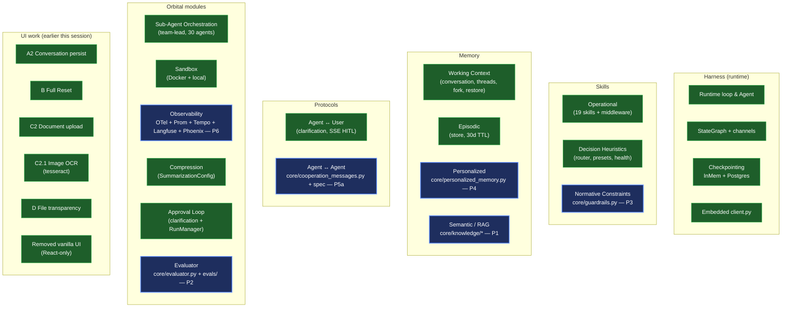
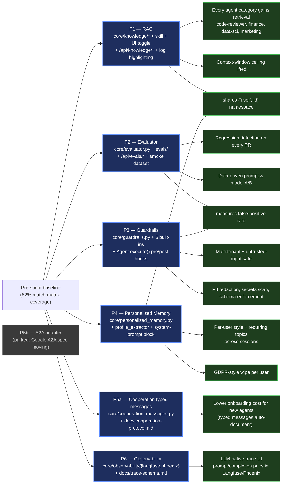
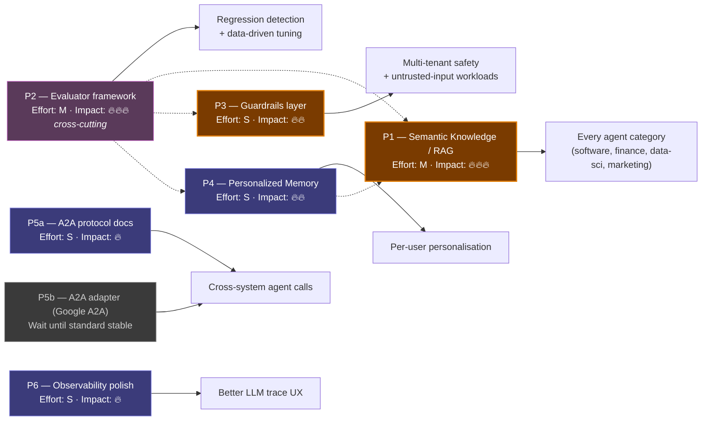

# Unified Roadmap — Agent Orchestrator

**Source of truth for "what's done, what's next, why."**
Consolidates the 5 deep-dive analyses under `analysis/` (deepflow, langgraph, paperclip, llm-use, harnessed-llm-agent) and the canonical `docs/roadmap.md` into a single dependency-aware view.

This file replaces fragmented per-analysis roadmaps for prioritisation purposes; the per-analysis files remain as research notes.

> **Want to try the new features instead of just reading?**
> Hands-on quickstart with copy-pasteable commands → [docs/quickstart-features.md](quickstart-features.md)

## Table of contents

| Section | What's in it |
|---|---|
| [TL;DR](#tldr) | One-screen sprint summary + numbers |
| [Why RAG matters](#why-rag-matters-for-every-execution-mode) | Misconception-buster: RAG benefits ALL execution modes |
| [Status snapshot](#status-snapshot-today) | Mermaid graph of what exists today (clickable nodes) |
| [Growth graph](#growth-graph-how-the-system-grew-this-sprint) | What this sprint added and what each unlocks |
| [Improvement graph (archived)](#improvement-graph-original-priority-order-now-archived-for-reference) | Original P1–P6 dependency view |
| [Priority cards](#priority-cards) | Collapsible per-priority cards with try-it examples |
| [Items already shipped](#items-already-shipped-dont-re-do) | Cross-reference of older roadmap items now in main |
| [Sprint history](#sprint-history-what-actually-happened) | Gantt of the actual parallel sprint |
| [What's next](#whats-next) | Concrete follow-ups after this sprint |

---

## TL;DR

- **Coverage of the harnessed-LLM-agent reference model**: **~95 %** (18 of 19 components ✅, only **#9 RAG** flipped from ❌ to ✅ during the Q1+Q2+Q3 sprint described below).
- **Q1+Q2 priorities P1–P6 all shipped** in this sprint, parallelised across 5 worktree agents and converged into main:
  - P1 RAG (knowledge subsystem + skill + UI toggle + log highlighting)
  - P2 Evaluator framework (LLMJudge + RubricEvaluator + EvalSuite + REST)
  - P3 Guardrails layer (PII / Secrets / PromptInjection / Schema / Cost)
  - P4 Personalized Memory namespace (`("user", id)` + profile extractor)
  - P5a Cooperation typed messages + protocol spec
  - P6 Observability polish (Langfuse + Phoenix optional exporters)
- **Single biggest gap remaining**: nothing critical. P5b (A2A adapter) is parked until the Google A2A spec stabilises.
- **Test count grew** from 1865 → 2065 (+200 new tests across 5 priorities) with 0 failures.

The "Growth graph" section below traces how each priority evolved the system and which downstream capabilities each one unlocks.

---

## Why RAG matters for every execution mode

A common misconception is that retrieval is only useful for "Simple Prompt" Q&A over an attached document. The truth is the opposite — RAG benefits **scale with agent complexity**:

| Mode | RAG benefit | Why |
|---|---|---|
| **Simple Prompt** | Low–Medium | A single file already fits via `file_context`. RAG kicks in only when content > context window. |
| **Single Agent** | **High** | Tool-using agents (code-reviewer, security-auditor, …) can call `retrieve(query)` to fetch only the relevant chunks instead of stuffing the whole repo into the prompt. |
| **Multi-Agent** | **Very High** | Per-agent and shared knowledge namespaces let team-lead delegate without manual context plumbing — each sub-agent pulls what it needs from its own namespace. |

The P1 design uses three namespaces: `("agent", name)`, `("shared",)`, `("user", id)`. The same store powers per-agent expertise, organisation-wide policy docs, and personalised memory (P4).

---

## Status snapshot (today)



Legend: green = ✅ done before this sprint, blue = ✅ shipped in this Q1+Q2 sprint. **Click any blue node** to jump to its source file (works in GitHub-rendered view).

Legend: green = ✅ done, yellow = ⚠️ partial, red = ❌ missing.

---

## Growth graph (how the system grew this sprint)

How each priority evolved the system, with the downstream capability each one enables. P1–P6 were built in **parallel across 5 worktree agents** rather than sequentially, then converged into main as separate commits.



**Why this order across 5 parallel worktrees:**

- The 5 priorities touch mostly disjoint files. Where they overlap (`core/agent.py`, `dashboard/app.py`, `dashboard/events.py`, `CLAUDE.md`, `docs/abstractions.md`), the edits are additive — each agent ADDS without rewriting. Convergence was a 3-way merge with mechanical conflict resolution.
- Worktree isolation guarantees no agent interferes with another's running tests.
- After convergence, **2065 / 2065 pytest pass** (was 1865 before this sprint — +200 tests).

---

## Improvement graph (original priority order, now archived for reference)

P1–P6 are the priorities from `analysis/harnessed-llm-agent/07-roadmap.md`. Arrows show **enabling relationships**, not strict prerequisites — every node can be built independently. **All shipped in this sprint** — kept for archaeology.



**Reading the graph:**

- Solid arrows = "this priority unlocks/produces this benefit".
- Dotted arrows = "P2 *measures* the quality of these other priorities" (cross-cutting, not a hard prerequisite).
- P4 dotted-arrow into P1 = personalised memory becomes meaningful only when you can retrieve from it (which is the same `KnowledgeStore` infrastructure as P1).

---

## Priority cards

> Each card is collapsed by default. Click the title to expand. Status badge in the summary.

<details>
<summary><strong>P1 — Semantic Knowledge / RAG</strong> &nbsp; ✅ <em>shipped</em> &nbsp; · &nbsp; Impact: 🔥🔥🔥 &nbsp; · &nbsp; Effort: M</summary>

| | |
|---|---|
| **Status** | ✅ Shipped — commits `3c1cac5` (core), `fda8bb5` (skill+API), `39d9cc1` (UI) |
| **Source design** | `analysis/harnessed-llm-agent/07-roadmap.md` §P1 |
| **Where it lives** | `core/knowledge/`, `skills/retrieval_skill.py`, `dashboard/knowledge_routes.py`, `frontend/src/...` |

**What it adds**
- `core/knowledge/`: `EmbeddingProvider` ABC + `HashEmbedder` (dev), `LocalEmbeddingProvider` (sentence-transformers, opt-in), `OpenAIEmbeddingProvider`. `KnowledgeStore` ABC + `InMemoryKnowledgeStore`. `Chunker` ABC + `MarkdownChunker` (header-aware) + `TextChunker`. `Ingester` and `Retriever` orchestrators. Namespaces: `("shared",)`, `("agent", name)`, `("user", id)`.
- `skills/retrieval_skill.py`: agents call `knowledge_retrieve` to fetch top-k chunks; result is a Markdown block with citations.
- `dashboard/knowledge_routes.py`: `POST /api/knowledge/ingest`, `POST /api/knowledge/search`, `GET /api/knowledge/namespaces`, `DELETE /api/knowledge/namespaces/{ns}`, `GET /api/knowledge/health`.
- Frontend: RAG checkbox + namespace input next to the Stream toggle in `ChatInput`. System bubble "RAG: \<namespace\> · N chunks retrieved (\<model\>)" before each assistant reply when enabled. Knowledge category in the event log with a distinct K icon.

**Try it (60-second walkthrough)**

```bash
# 1. Ingest a doc into the "shared" namespace (works against the in-memory store
#    that ships by default — no infra needed).
curl -sX POST http://localhost:5005/api/knowledge/ingest \
  -H 'Content-Type: application/json' \
  -d '{
    "source_id": "auth-doc",
    "namespace": "shared",
    "text": "# Auth\n\nUse JWT tokens. Sessions are stateless. Tokens expire after 24h."
  }'
# → {"success": true, "chunks_added": 1, ...}

# 2. Search:
curl -sX POST http://localhost:5005/api/knowledge/search \
  -H 'Content-Type: application/json' \
  -d '{"query": "how do auth tokens work?", "namespace": "shared", "k": 3}'
# → {"hits":[{"score":..., "text":"# Auth\n\nUse JWT tokens..."}]}

# 3. Send a chat with RAG turned on (the toggle is the "RAG" checkbox in
#    ChatInput; or via API:)
curl -sX POST http://localhost:5005/api/prompt \
  -H 'Content-Type: application/json' \
  -d '{
    "prompt": "How do auth tokens work?",
    "model": "openai/gpt-4o",
    "provider": "openrouter",
    "rag_enabled": true,
    "rag_namespace": "shared"
  }'
# → response includes a `rag` summary; an event "knowledge.retrieved" is emitted.
```

**Benefits unlocked**
- Code-reviewer searches the codebase, finance pulls filings, data-science looks up schemas — every agent category gains retrieval.
- Removes the context-window ceiling.
- Same store powers per-user personalisation (P4) for free via the `("user", id)` namespace.

**Production swap-in (one-liner each)**
- Sentence-transformers embedder: `RAG_EMBEDDING_PROVIDER=local RAG_LOCAL_MODEL=all-MiniLM-L6-v2`
- OpenAI embedder: `RAG_EMBEDDING_PROVIDER=openai RAG_OPENAI_MODEL=text-embedding-3-small`

</details>

<details>
<summary><strong>P2 — Evaluator framework</strong> &nbsp; ✅ <em>shipped</em> &nbsp; · &nbsp; Impact: 🔥🔥🔥 (cross-cutting) &nbsp; · &nbsp; Effort: M</summary>

| | |
|---|---|
| **Status** | ✅ Shipped — commit `ca57ba0` |
| **Source design** | `analysis/harnessed-llm-agent/07-roadmap.md` §P2 |
| **Where it lives** | `core/evaluator.py`, `evals/`, `dashboard/evals_routes.py` |

**What it adds**
- `core/evaluator.py`: `Evaluator` ABC, `RubricEvaluator` (deterministic checks: regex, contains, JSON schema, min/max length, with weights), `LLMJudge` (Provider-injected, robust JSON extraction), `EvalSuite` end-to-end runner, `JsonDataset` loader, `EvalReport` with pass_rate / mean_score summary.
- `evals/datasets/smoke.json`: 5 hand-picked smoke cases (code summary, math reasoning, JSON output, safety refusal, conversational).
- `evals/runners/cli.py`: `python -m evals.runners.cli --suite evals/datasets/smoke.json --agent team-lead --provider openrouter --model openai/gpt-4o` — coloured table, `--dry-run`, `--json` output, HTTP agent mode.
- REST: `POST /api/evals/run`, `GET /api/evals/runs`, `GET /api/evals/runs/{id}`, `GET /api/evals/compare?a=&b=`.

**Try it**

```bash
# Run the smoke suite locally with the dry-run agent (no LLM call).
python -m evals.runners.cli --suite evals/datasets/smoke.json --dry-run

# Output (truncated):
#   case_id     | passed | mean_score | detail
#   ----------- | ------ | ---------- | -----------------------------
#   code-001    |   ✓    |    1.00    | rubric: contains "summary" OK
#   math-001    |   ✗    |    0.00    | rubric: contains "42" failed
#   ...
#   pass_rate=0.60 mean_score=0.65

# Compare two runs over HTTP (after running two suites):
curl -s 'http://localhost:5005/api/evals/compare?a=run-1&b=run-2'
# → {"delta_pass_rate": +0.10, "delta_mean_score": +0.07, ...}
```

**Benefits unlocked**
- Closes the feedback loop. Without P2, P1 retrieval quality, P3 false-positive rate, prompt-tuning experiments, model swaps — all are blind flights.
- Drop-in CI gate: a GitHub Action can fail PRs whose pass_rate regresses > 5%.

**Cross-cutting**: P2 is independent of P1/P3/P4 to build, but it *measures* their quality. Build it any time; impact compounds.

</details>

<details>
<summary><strong>P3 — Guardrails layer</strong> &nbsp; ✅ <em>shipped</em> &nbsp; · &nbsp; Impact: 🔥🔥 &nbsp; · &nbsp; Effort: S</summary>

| | |
|---|---|
| **Status** | ✅ Shipped — commit `3fee888` |
| **Source design** | `analysis/harnessed-llm-agent/07-roadmap.md` §P3 |
| **Where it lives** | `core/guardrails.py`, `core/agent.py` (integration), `dashboard/events.py`, `orchestrator.yaml.example` |

**What it adds**
- `core/guardrails.py`: `Guardrail` ABC + `GuardrailResult(passed, reason, action: allow|block|redact)` + `GuardrailManager`. Built-ins:
  - `PIIScanner` — email / phone / SSN / IBAN / credit cards (default: redact)
  - `SecretsScanner` — AWS keys, GitHub tokens, generic API keys (default: block)
  - `PromptInjectionDetector` — heuristic for "ignore previous instructions", "system prompt", "you are now" (default: block)
  - `OutputSchemaGuard(schema)` — JSON Schema validation on assistant output (default: block)
  - `CostGuard(budget_usd, get_current_cost)` — kill the run if projected cost exceeds budget (default: block)
- Integration in `Agent.execute()`: pre-LLM `run_input(messages)` check; post-LLM `run_output(response)` check. On block → `GuardrailBlocked` exception; on redact → messages substituted.
- Events: `guardrail.checked`, `guardrail.blocked`, `guardrail.redacted`. Counters: `guardrail_checks_total{type,side}`, `guardrail_blocks_total{type}`, `guardrail_redactions_total{type}`.
- YAML config:
  ```yaml
  guardrails:
    input:
      - type: pii_scanner
        action: redact
      - type: secrets_scanner
        action: block
    output:
      - type: output_schema
        schema_path: ./schemas/response.json
        action: block
  ```

**Try it (Python)**

```python
from agent_orchestrator.core.guardrails import (
    GuardrailManager, PIIScanner, SecretsScanner,
)
from agent_orchestrator.core.provider import Message, Role

mgr = GuardrailManager()
mgr.register(PIIScanner(action="redact"))
mgr.register(SecretsScanner(action="block"))

result = await mgr.run_input([
    Message(role=Role.USER, content="My email is alice@example.com"),
])
print(result.action, "→", result.redacted_text)
# allow → "My email is [EMAIL_REDACTED]"

result = await mgr.run_input([
    Message(role=Role.USER, content="My AWS key is AKIA1234567890ABCDEF"),
])
print(result.action, "→", result.reason)
# block → "Detected AWS access key"
```

**Benefits unlocked**
- Required for multi-tenant deployment or untrusted user input.
- Cheap now (S effort), painful to retrofit once agents are wired into customer paths.
- Each guardrail is independent: pick & choose.

</details>

<details>
<summary><strong>P4 — Personalized Memory</strong> &nbsp; ✅ <em>shipped</em> &nbsp; · &nbsp; Impact: 🔥🔥 &nbsp; · &nbsp; Effort: S</summary>

| | |
|---|---|
| **Status** | ✅ Shipped — commit `b945312` |
| **Source design** | `analysis/harnessed-llm-agent/07-roadmap.md` §P4 |
| **Where it lives** | `core/personalized_memory.py`, `skills/profile_extractor_skill.py`, `dashboard/personalized_memory_routes.py`, `core/agent.py` (system prompt) |

**What it adds**
- `core/personalized_memory.py`: `PersonalizedMemory` facade over `BaseStore` with user-scoped helpers (`put`, `get`, `list`, `delete`, `wipe`). Honours the existing `MemoryFilter` rules.
- `skills/profile_extractor_skill.py`: extracts preferences/style/recurring topics from recent messages and persists them. Best-effort: a Provider failure does NOT break the agent flow.
- `core/agent.py`: optional `personalized_memory` and `user_id` kwargs. `build_system_prompt` appends a `<user_profile>` block when both are set.
- REST: `GET /api/user-memory/users/{user_id}`, `GET /api/user-memory/users/{user_id}/{key}`, `DELETE /api/user-memory/users/{user_id}/{key}`, `DELETE /api/user-memory/users/{user_id}` (GDPR-style wipe).

**Try it**

```bash
# Save a user preference
curl -sX PUT http://localhost:5005/api/user-memory/users/u-123/style \
  -H 'Content-Type: application/json' \
  -d '{"value": {"prefers": "concise answers, code blocks over prose"}}'

# Read it back
curl -s http://localhost:5005/api/user-memory/users/u-123
# → {"items":[{"key":"style","value":{"prefers":"..."}}, ...]}

# GDPR wipe
curl -sX DELETE http://localhost:5005/api/user-memory/users/u-123
# → {"success": true, "removed": 1}
```

**Benefits unlocked**
- Per-user style / preferences without manual prompt engineering.
- Foundation for any "recall what we discussed last week" UX.
- Reuses the existing `BaseStore` — no new infra.

</details>

<details>
<summary><strong>P5a — Agent ↔ Agent typed messages + spec</strong> &nbsp; ✅ <em>shipped</em> &nbsp; · &nbsp; P5b deferred &nbsp; · &nbsp; Effort: S</summary>

| | |
|---|---|
| **Status** | ✅ Tactical (P5a) shipped — commit `e7dbfa0`. Strategic (P5b A2A) deferred to Q3. |
| **Source design** | `analysis/harnessed-llm-agent/07-roadmap.md` §P5 |
| **Where it lives** | `core/cooperation_messages.py`, `docs/cooperation-protocol.md` |

**What it adds**
- Frozen typed dataclasses: `CooperationMessage` (base), `DelegateMessage`, `ResultMessage`, `CapabilityQueryMessage`, `CapabilityResponseMessage`, `ConflictMessage`. Each round-trips with the existing dict shape (`from_dict` / `to_dict`).
- `parse_message(d) -> CooperationMessage` dispatcher on the `kind` field.
- `docs/cooperation-protocol.md` — protocol spec with mermaid sequence + state diagrams, error handling, migration path.
- Backwards-compatible: existing dict callers in `cooperation.py` keep working.

**Try it (Python)**

```python
from agent_orchestrator.core.cooperation_messages import (
    DelegateMessage, ResultMessage, parse_message,
)

msg = DelegateMessage(
    message_id="m-1",
    from_agent="team-lead",
    to_agent="backend",
    timestamp=1234,
    kind="delegate",
    task_id="t-1",
    description="Build the JWT login endpoint",
    priority="high",
    payload={"due": "tomorrow"},
)
d = msg.to_dict()
parsed = parse_message(d)
assert isinstance(parsed, DelegateMessage)
```

**P5b status**: parked. Google's A2A spec is still moving (April 2026). Re-evaluate in Q3.

</details>

<details>
<summary><strong>P6 — Observability polish</strong> &nbsp; ✅ <em>shipped</em> &nbsp; · &nbsp; Impact: 🔥 &nbsp; · &nbsp; Effort: S</summary>

| | |
|---|---|
| **Status** | ✅ Shipped — commit `ca57ba0` |
| **Source design** | `analysis/harnessed-llm-agent/07-roadmap.md` §P6 |
| **Where it lives** | `core/observability/`, `core/tracing.py`, `docs/trace-schema.md` |

**What it adds**
- `core/observability/langfuse_exporter.py` — registers a Langfuse span processor. Configured by `LANGFUSE_PUBLIC_KEY`, `LANGFUSE_SECRET_KEY`, `LANGFUSE_HOST`. Optional dep: `pip install 'agent-orchestrator[langfuse]'`.
- `core/observability/phoenix_exporter.py` — registers a Phoenix (Arize) OTLP HTTP exporter. Configured by `PHOENIX_COLLECTOR_ENDPOINT`, `PHOENIX_API_KEY`. Optional dep: `pip install 'agent-orchestrator[phoenix]'`.
- Both exporters degrade gracefully when their package is missing or env vars aren't set.
- `docs/trace-schema.md` — full inventory of every span emitted (name, attributes, events, source location) plus how to view traces in Tempo / Langfuse / Phoenix.

**Try it**

```bash
# Langfuse (cloud or self-hosted)
export LANGFUSE_PUBLIC_KEY=pk-…
export LANGFUSE_SECRET_KEY=sk-…
export LANGFUSE_HOST=https://cloud.langfuse.com
pip install -e ".[langfuse]"
docker compose up dashboard
# → traces flow to Langfuse alongside Tempo. Existing OTel pipeline unaffected.

# Phoenix (local)
docker run -d -p 6006:6006 arizephoenix/phoenix:latest
export PHOENIX_COLLECTOR_ENDPOINT=http://localhost:6006
pip install -e ".[phoenix]"
docker compose up dashboard
# → http://localhost:6006 shows LLM traces with prompt/completion pairs.
```

**Benefits unlocked**
- LLM-native trace UI (prompt/completion pairs, eval scores) for debugging individual agent runs.
- Pure additive — no risk to the existing Tempo/Prometheus pipeline.

</details>

---

## Items already shipped (don't re-do)

These appeared as "improvements" in older analyses (langgraph, llm-use, deepflow, paperclip) but are now in main and don't need work. Listed here so they don't sneak back into a "new roadmap" by accident.

| Item | Source | Where it lives now |
|---|---|---|
| Channel-based state with reducers | langgraph Phase 1 | `core/channels.py`, `core/graph.py` |
| Conformance test suite for Provider | langgraph Phase 1 | `core/conformance.py` |
| Task-level result caching | langgraph Phase 1 | `core/cache.py` |
| Interrupt/resume HITL | langgraph Phase 2 | `core/clarification.py`, `dashboard/sse.py` |
| Store abstraction (cross-agent) | langgraph Phase 2 | `core/store.py`, `core/store_postgres.py` |
| Skill middleware pattern | langgraph Phase 2 | `core/skill.py` middleware chain |
| Loop detection middleware | llm-use 1.1 | `core/loop_detection.py` |
| Tool description parameter | llm-use 1.3 | provider message types |
| Progressive skill loading | llm-use 2.1 | implemented |
| Configurable context summarisation | llm-use 2.2 | `SummarizationConfig` |
| Embedded client | llm-use 3.1 | `client.py` |
| File upload & conversion | deepflow 4.3 | `core/document_converter.py` + `/api/upload` |
| Image OCR (tesseract) | this session | `_convert_image` (commit `edaa0be`) |
| Sandbox execution | deepflow 4.2 | `core/sandbox.py`, `dashboard/sandbox_manager.py` |
| Slack / Telegram integration | deepflow 5 | `integrations/slack_bot.py`, `telegram_bot.py` |
| Harness/App boundary | deepflow 6.1 | enforced by `tests/test_import_boundary.py` |
| Conversation persistence (multi-turn) | this session | A2 — commit `53ea2a0` |
| Full Reset (chat + memory + files + graph) | this session | B — commit `2a48e43` |
| File context transparency | this session | D — commit `7736ef5` |
| Removed dual UI fallback | this session | commit `1719a54` |
| Agent ↔ Agent cooperation spec + typed messages (P5a) | `analysis/harnessed-llm-agent/07-roadmap.md` §P5a | `core/cooperation_messages.py`, [`docs/cooperation-protocol.md`](cooperation-protocol.md) |

---

## Sprint history (what actually happened)

Originally planned as a quarterly sequence. In practice, P1–P6 were built **in parallel across 5 worktree agents** and converged in a single afternoon:

```mermaid
gantt
    title Actual sprint timeline
    dateFormat  HH:mm
    axisFormat  %H:%M
    section Sequential (main)
    P1 RAG core (M)             :done, p1c, 11:00, 30m
    P1 RAG skill+API (M)        :done, p1s, after p1c, 25m
    P1 RAG UI toggle (M)        :done, p1u, after p1s, 25m
    section Parallel (worktrees)
    P3 Guardrails (S)           :done, p3, 11:50, 30m
    P2 Evaluator (M)            :done, p2, 11:50, 35m
    P4 Personalized Memory (S)  :done, p4, 11:50, 40m
    P5a Cooperation spec (S)    :done, p5a, 11:50, 20m
    P6 Observability (S)        :done, p6, 11:50, 25m
    section Convergence
    Merge worktrees + tests     :done, conv, 12:35, 15m
    Final docs + push           :done, fin, after conv, 5m
    section Parked
    P5b A2A adapter (L)         :crit, 2026-09-01, 21d
```



**Why parallel beat sequential here:**

1. The 5 priorities are **mostly disjoint**: each owns its own module(s) and tests. Shared file edits (CLAUDE.md, abstractions.md, agent.py kwargs, app.py router includes, events.py event types) are **additive** by design — every agent appends, none rewrite.
2. SOLID compliance pays off at convergence: the new abstractions (`KnowledgeStore`, `Guardrail`, `Evaluator`, `PersonalizedMemory`) plug into existing seams (`Agent.__init__`, `app.state`, EventBus) without colliding.
3. Convergence = three-way merges + a short conflict resolution on `agent.py` (combined kwargs) and `app.py` (combined router includes). Less than 15 minutes of manual work.
4. The original "P1 → P3 → P2 → P4 → P5a → P6" sequencing is preserved as the **archived improvement graph** above for historical context.

---

## Definition of done (per priority)

Every roadmap item is "done" only when:

1. Implementation + unit tests
2. Integration test through `Orchestrator` or `Agent`
3. Docs updated: `CLAUDE.md`, relevant `docs/*.md`, this file
4. Metrics exported to Prometheus
5. Example in `examples/` or the embedded client

---

## Pointers

- Per-component status: `analysis/harnessed-llm-agent/06-match-matrix.md` (now 18/19 ✅)
- Original roadmap with full implementation plans: `analysis/harnessed-llm-agent/07-roadmap.md`
- Older domain-specific roadmaps (mostly already shipped): `analysis/{deepflow,langgraph,llm-use,paperclip}/`
- Canonical product roadmap (Phase 0 / Phase 2 / Phase 3 etc.): `docs/roadmap.md`
- Cooperation protocol spec: `docs/cooperation-protocol.md`
- Trace schema (Tempo / Langfuse / Phoenix): `docs/trace-schema.md`

## What's next

The match matrix has only one ⚠️ row left and zero ❌. Realistic next steps:

1. **Hook P3 Guardrails into the production agents** (currently optional kwarg). Pick a default-on safe set (PII redact + Secrets block) for multi-tenant deployments.
2. **Wire P2 Evaluator into CI**: add a small smoke suite as a GitHub Action gate that fails on regression > 5%.
3. **Swap RAG defaults**: HashEmbedder is dev-only; production should use `LocalEmbeddingProvider` (sentence-transformers) or `OpenAIEmbeddingProvider`. PgVector backend instead of `InMemoryKnowledgeStore` once usage grows.
4. **v1.4 — Reference-matrix gap closure** — see below.
5. **`ago` Rust CLI** — local→remote client, see below.

### Rust CLI (`ago`)

Provider-agnostic, single-binary client that lets a local project talk to a remote orchestrator the same way `gh` talks to GitHub. Lives in [`cli/`](../cli/) at repo root. Full design + security model in [docs/cli.md](cli.md).

| Phase | Scope | Status (2026-06-04) |
|---|---|---|
| 1 — Skeleton + auth | `login` / `logout` / `whoami` / `config`, OS-keychain token storage, rustls-only HTTP, `/api/cli/v1/whoami` server endpoint | ✅ Done (v0.1.0) |
| 2 — Core execution | Device-flow OAuth (RFC 8628), `ago run "<task>"` with SSE streaming, agent/skill flags, `.ago.yaml` project preset, `--json` output | planned |
| 3 — Observability & UX | `ago jobs list/get/cancel`, `ago logs --follow`, progress bars, shell completions | planned |
| 4 — Hardening & release | `cargo audit`/`deny`/`vet` in CI, cross-compile (mac arm/x64, linux x64/arm64 musl, windows), signed releases via `cosign` + SBOM, Homebrew tap, GitHub Release v0.1.0 | planned |
| 5 — Chat + project context | `ago chat` REPL (v0.2.0), `@file` / `@dir/` references (v0.3.0), `.ago.yaml context:` overrides (v0.3.1), Windows path support (v0.3.2), `cache` subcommand + OpenRouter `cache_control` plumbing for `@file` context (v0.4.0–v0.4.1), recursive `@dir/**` content expansion (v0.4.2) | ✅ Done (v0.4.2) |
| 6 — UX polish | `--resume` (per-server `conversation_id` persisted in `state.toml`), `AGO.md` project instructions auto-load (client-side, prepended to `cache_context` so the OpenRouter cache covers it), code-fence colouring in assistant output, top-level `--no-color` flag (v0.5.0) | ✅ Done (v0.5.0) |

---

## v1.4 — External Reference Gap Closure (Q3 2026, planned)

Cross-analysis of `analysis/{deepflow,langgraph,harnessed-llm-agent}` to find what the orchestrator still lacks. **Methodology**: every candidate was grep-verified against `src/` before being added — 10 of 16 first-draft items turned out to already be on `main` and were pruned. The 6 surviving items below are the v1.4 scope.

### Verified shipped — pruned from the v1.4 draft

This row extends the [Items already shipped](#items-already-shipped-dont-re-do) table with the audit trail of the v1.4 pruning pass:

| Item | Where it lives now |
|---|---|
| Loop detection middleware | `core/loop_detection.py` (+ `tests/test_loop_detection.py`) |
| Sandboxed code execution | `core/sandbox.py`, `skills/sandboxed_shell.py` |
| Progressive skill loading | `skills/skill_loader.py` |
| Structured clarification protocol | `core/clarification.py`, `skills/clarification_skill.py` |
| Dangling tool-call recovery | `core/tool_recovery.py::recover_dangling_tool_calls` |
| Typed channels (`LastValue` / `Topic` / …) | `core/channels.py` |
| Per-node CachePolicy | `core/cache.py` |
| Skill middleware chain | `core/skill.py` (+ `tests/test_skill_middleware.py`) |
| RetryPolicy + circuit breaker | `core/resilience.py::RetryPolicy`, `CircuitBreaker`, `resilient_call` |
| Conformance test suite | `core/conformance.py` |
| `tool_description` parameter | `core/skill.py` (`SkillRequest.metadata["tool_description"]`) |
| Configurable summarisation triggers | `core/conversation.py::SummarizationConfig` (TOKEN / MESSAGE / FRACTION + `retain_last`) |
| Config versioning + auto-upgrade | `core/yaml_config.py` (`config_version`, `_upgrade_v0_to_v1`, `CURRENT_CONFIG_VERSION`) |
| Memory upload filter | `core/memory_filter.py::MemoryFilter` |

### Genuinely missing — the v1.4 scope

#### P1 — Must-have

<details>
<summary><strong>A2A adapter (un-park P5b)</strong> &nbsp; ⚠ → ✅ target &nbsp; · &nbsp; Effort: L &nbsp; · &nbsp; Impact: 🔥🔥</summary>

| | |
|---|---|
| **Status** | ⚠️ Planned |
| **Source design** | `analysis/harnessed-llm-agent/07-roadmap.md` §P5b |
| **Will live in** | `core/cooperation/a2a_adapter.py` + `/api/a2a/` |

**What it adds**
- Bidirectional bridge with Google's A2A protocol so external A2A agents appear as local cooperation peers and vice-versa.
- Builds on top of `core/cooperation_messages.py` (already in `main` since v1.3.0 P5a).
- Closes the only remaining ⚠ on the 19-row reference matrix.

**Why now**: spec churn was the reason for the Q1 park; the April-2026 stabilisation has landed.

</details>

<details>
<summary><strong>Managed values (computed state)</strong> &nbsp; ⚪ → ✅ target &nbsp; · &nbsp; Effort: M &nbsp; · &nbsp; Impact: 🔥🔥</summary>

| | |
|---|---|
| **Status** | 🆕 Planned |
| **Source design** | `analysis/langgraph/09-managed-values.md` |
| **Will live in** | new `core/managed_values.py` + Pregel-loop hook in `core/graph.py` |

**What it adds**
- LangGraph-style read-only injections into node state: `step_count`, `remaining_steps`, `interrupt_ids`, `is_final_step`.
- Computed at runtime by the engine, **never checkpointed**.
- Lets nodes self-throttle (`if remaining_steps < 2: summarise_and_finish()`) without polluting `State` schemas.

</details>

#### P2 — Nice-to-have

<details>
<summary><strong>Personalized Memory dashboard UI</strong> &nbsp; ⚪ → ✅ target &nbsp; · &nbsp; Effort: M &nbsp; · &nbsp; Impact: 🔥</summary>

| | |
|---|---|
| **Status** | 🆕 Planned |
| **Source design** | Closes the loop on v1.3.0 P4 |
| **Will live in** | `frontend/src/components/memory/UserMemoryPanel.tsx` |

**What it adds**
- REST endpoints `/api/user-memory/users/*` exist since v1.3.0 P4, but no React page consumes them (verified — `frontend/src/components/` has no `user-memory` references).
- New page lists per-user keys, lets the user edit / delete entries, shows the last `<user_profile>` block injected into the system prompt, and exposes a GDPR wipe button.

</details>

<details>
<summary><strong>Granular stream modes (close the gap to LangGraph 7)</strong> &nbsp; ⚪ → ✅ target &nbsp; · &nbsp; Effort: M &nbsp; · &nbsp; Impact: 🔥</summary>

| | |
|---|---|
| **Status** | 🆕 Planned |
| **Source design** | `analysis/langgraph/27-streaming.md` |
| **Will live in** | `dashboard/sse.py` + new frontend selector |

**What it adds**
- `dashboard/sse.py` ships 2 of LangGraph's 7 modes today: `events` (default) and `values` (verified at lines 118 and 270).
- Add the 5 missing modes: `updates` (per-node delta), `messages` (LLM-message stream only), `tasks` (task lifecycle), `debug` (verbose internal), `custom` (user-emitted via `emit()`).
- Selectable per WebSocket subscription.

</details>

#### P3 — Optional

<details>
<summary><strong>Content-addressed checkpoint blobs</strong> &nbsp; Effort: S &nbsp; · &nbsp; Impact: 🔥</summary>

In `core/store_postgres.py` / `PostgresCheckpointer`, split large state values into a `blobs(sha256 PRIMARY KEY, payload BYTEA)` table and reference by hash. Repeated values across checkpoints share a single row. **Expected**: 5-20× storage reduction on long conversations where the same RAG context or system prompt repeats.

</details>

<details>
<summary><strong>Structured deprecation annotations</strong> &nbsp; Effort: S &nbsp; · &nbsp; Impact: 🔥</summary>

`@deprecated(since="1.4", removed_in="1.6", migration="use X instead")` decorator that emits a `DeprecationWarning` + powers a `docs/deprecations.md` page generated at release time. Currently zero `@deprecated` / `DeprecationWarning` hits in `core/`. Pre-requisite for any 2.x cleanup pass.

</details>

### Sprint shape

| Worktree | Owner | Item |
|---|---|---|
| 1 | backend | A2A adapter (largest) |
| 2 | architect | Managed values (Pregel-loop change — needs careful design) |
| 3 | backend | Content-addressed blobs + deprecation decorator (both small, same dev) |
| 4 | frontend | Personalized Memory UI + 5 missing stream-modes UI selector |

**Match-matrix target**: **19/19 ✅** by end of sprint.

Full per-item cards: [website roadmap → v1.4](https://pjcau.github.io/agent-orchestrator/docs/roadmap/v140-gap-closure).

---

## v1.5 P1 — Workspace Repair Loop (Q3 2026, in progress)

A workspace-level verify-and-retry pipeline that wraps `run_team()`. Different scope from the existing per-skill `verification_middleware` (PR #59): the latter validates a single `SkillResult`; this one validates the **whole filesystem state** after a multi-step team run and re-invokes the team with a structured retry prompt up to 5 times.

**Motivation**: `docs/learning-path-tests/2026-05-16_task-tracker.md` — a single `psycopg<3` dep typo cascaded through Build → Runtime → Functional and erased 48 points (confidence 32.5/100 vs the 79.01 baseline). A 5-attempt repair loop fed by the failing tool's stderr would have fixed it in one retry.

### Phase plan (7 phases)

| Phase | Status | Deliverable | Where it lives |
|---|---|---|---|
| 1 | ✅ Done | Design doc | `docs/architecture-repair-loop.md` |
| 2 | ✅ Done | `VerificationGate` + 3 verifiers | `core/verification_gate.py`, `core/verifiers/{syntax,encoding,dependency}.py` |
| 3 | ✅ Done | `RepairLoop` harness | `core/repair_loop.py` |
| 4 | ✅ Done | `FailurePatternRegistry` + bundled YAML | `core/failure_patterns.py`, `core/failure_patterns.yaml` |
| 5 | ✅ Done | Wire into `/api/team/run` (opt-in) | `dashboard/agent_runtime_router.py`, `dashboard/events.py`, `orchestrator.yaml.example` |
| 6 | ✅ Done | Feature maps + roadmap sync | this file, `docs/website/architecture-map.yaml`, `*-map.json`, `sidebars.js` |
| 7 | ✅ Done | Learning-path validation run + 4 follow-up patches (7.1–7.4) | `docs/learning-path-tests/2026-05-16b_repair-loop.md` |
| 7.1 | ✅ Done | `ImportVerifier` (catches missing-dep failures the 3-verifier chain missed) | `core/verifiers/imports.py`, `core/failure_patterns.{py,yaml}` |
| 7.2 | ✅ Done | `WorkspaceCoherenceVerifier` (cross-file contradictions) | `core/verifiers/coherence.py` |
| 7.3 | ✅ Done | React dashboard surfaces `repair: {…}` summary | `frontend/src/api/types.ts`, `frontend/src/hooks/useWebSocket.ts` |
| 7.4 | ✅ Done | Default verifier chain extended to 5 | `dashboard/agent_runtime_router.py`, `orchestrator.yaml.example` |
| 7.5 | ✅ Done | Benchmark re-run with the 5-verifier chain — 71.2/100, +22.2 vs run (b) | `docs/learning-path-tests/2026-05-16c_repair-loop-v2.md` |
| 7.6 | ✅ Done | `ImportVerifier` alias-map fix: psycopg2 ↔ psycopg2-binary (regression from custom-goal weather-portal run) | `core/verifiers/imports.py`, `core/failure_patterns.yaml` |
| 7.7 | ✅ Done | Abstraction-level fix: `RuntimeSmokeVerifier` ground-truth tier + post-condition revert guard in `RepairLoop._try_auto_fix` | `core/verifiers/runtime_smoke.py`, `core/repair_loop.py`, `core/failure_patterns.py` |
| 7.8 | ✅ Done | Re-run weather-portal benchmark with 6-verifier chain + revert guard — 74.2/100 on iter 0 alone (+25.4 vs (d)); iter 1 hung surfaces cache-miss issue | `docs/learning-path-tests/2026-05-16e_weather-portal-v2.md` |
| 7.9 | ✅ Done | (a) `max_wall_s` cap in RepairLoop + new `aborted_time` status, (b) per-verifier `duration_ms` in `verifier.finished` events, (c) smoke verifier canonical-set cache + strict-subset delta install | `core/repair_loop.py`, `core/verification_gate.py`, `core/verifiers/runtime_smoke.py` |
| 7.10 | ✅ Done | Benchmark re-run (f): 82.0/100 — new all-time high. 6/6 iters; iter-1 hang from (e) eliminated. | `docs/learning-path-tests/2026-05-16f_weather-portal-v3.md` |
| 7.11 | ✅ Done | (a) `EntrypointVerifier` — launches the Dockerfile CMD / compose command (uvicorn) with health probe (catches relative-import + startup crashes the bare-import probe misses); (b) `E2ESmokeVerifier` opt-in via `REPAIR_LOOP_E2E_ENABLED=true` — headless Chromium against the frontend (catches integration bugs like shape mismatches, missing CORS, broken fetches). Bundled chain: 6 → 8. | `core/verifiers/entrypoint.py`, `core/verifiers/e2e_smoke.py` |
| 7.12 | ⏳ Pending | Re-run three.js-space-app benchmark with Entrypoint + E2E active | `docs/learning-path-tests/2026-05-XX_space-threejs-v2.md` |

### Configuration

**ON by default** since Phase 7. Opt out with `REPAIR_LOOP_ENABLED=false`.

```bash
# Defaults are equivalent to:
export REPAIR_LOOP_ENABLED=true        # set to "false" to opt out
export REPAIR_LOOP_MAX_ATTEMPTS=5
export REPAIR_LOOP_MAX_COST_USD=0.50
```

YAML mirror: `repair_loop:` block in `orchestrator.yaml.example`.

### Expected impact (estimate, validated in Phase 7)

| Metric | Before | After (estimate) |
|---|---:|---:|
| 2026-05-16 confidence score | 32.5 / 100 | ~85 / 100 |
| First-attempt failures auto-fixed (no LLM call) | 0 % | ≥ 33 % (targeted by bundled patterns) |
| `success: true` reported on broken workspaces | possible | gated by verifier chain |

Full design: [`docs/architecture-repair-loop.md`](https://github.com/pjcau/agent-orchestrator/blob/main/docs/architecture-repair-loop.md). Per-phase deliverables: [website roadmap → v1.5](https://pjcau.github.io/agent-orchestrator/docs/roadmap/v150-repair-loop).
