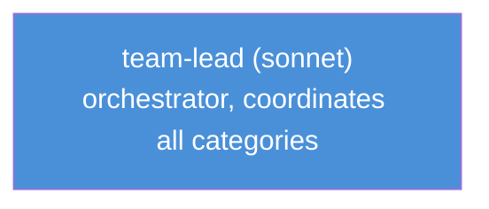
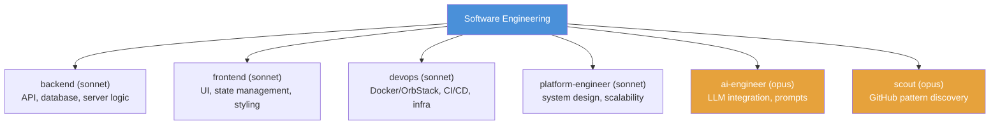
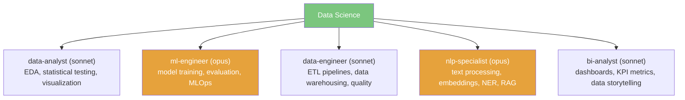
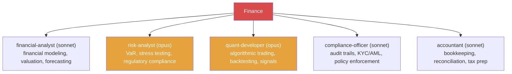
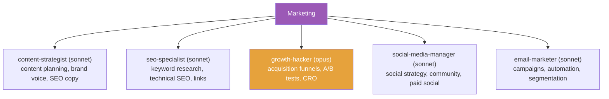
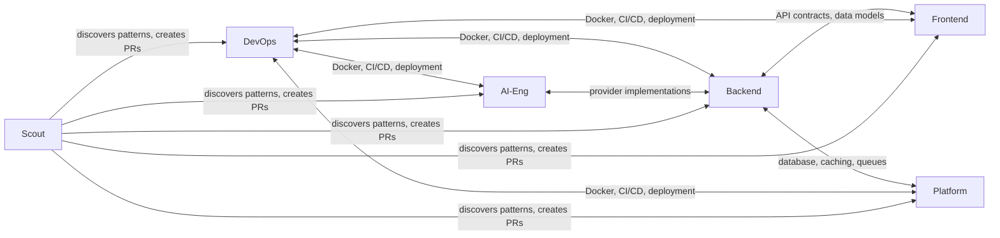
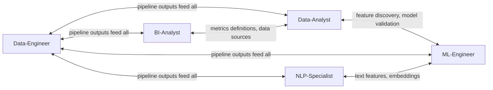
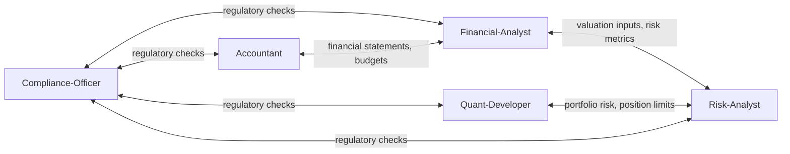
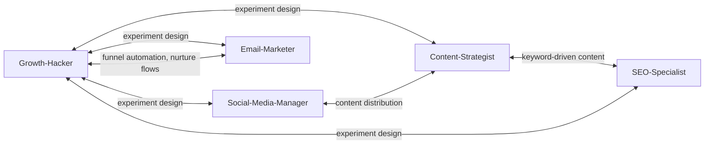

# Agents

An agent is a stateless unit that receives a task, uses tools, and returns a result.

```python
@dataclass
class AgentConfig:
    name: str
    role: str                          # system prompt / persona
    provider: str                      # provider key
    tools: list[str]                   # allowed tool names
    max_steps: int = 10                # anti-stall: hard step limit
    max_retries_per_approach: int = 3  # anti-stall: retry cap
```

Agents are **provider-parameterized** — the same agent definition can run on Claude, GPT, or a local model by swapping the provider.

## Agent Categories

Agents are organised by **category** under `.claude/agents/<category>/`.
The `team-lead` lives at root level and coordinates all categories.



### Software Engineering (6 agents)



### Data Science (5 agents)



### Finance (5 agents)



### Marketing (5 agents)



## Cross-Agent Dependencies

### Software Engineering



### Data Science



### Finance



### Marketing


