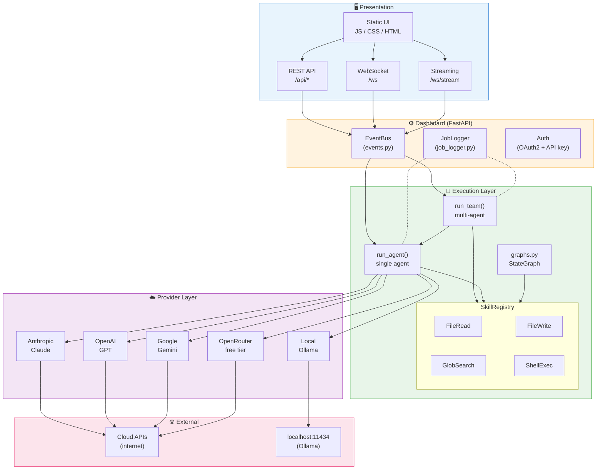
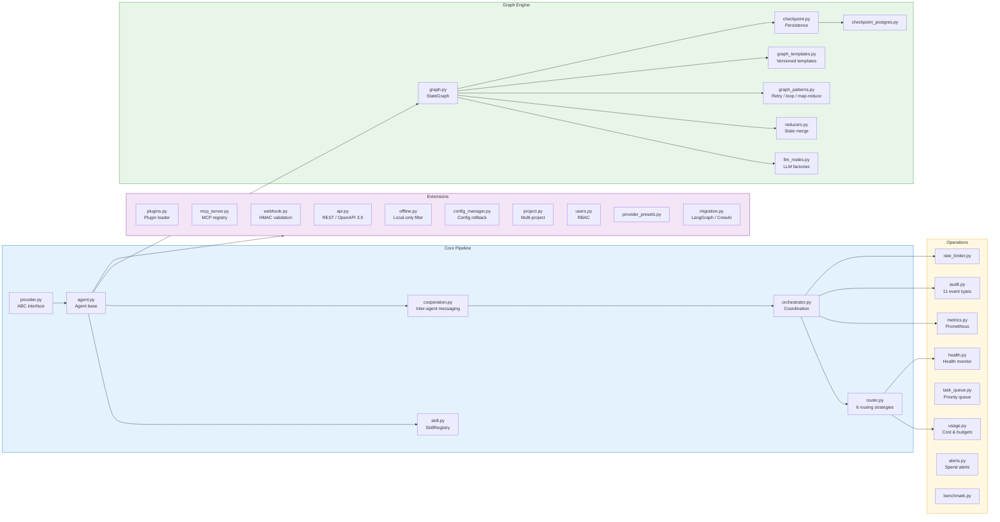
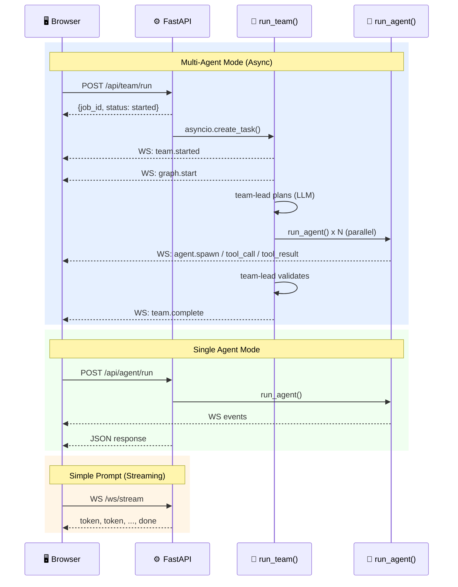
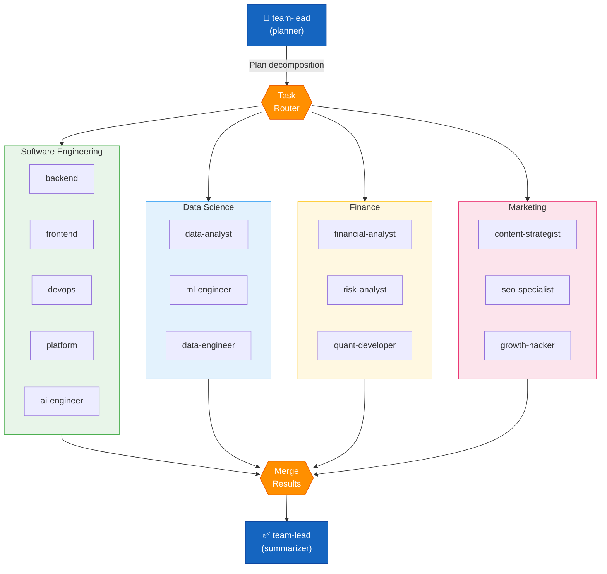
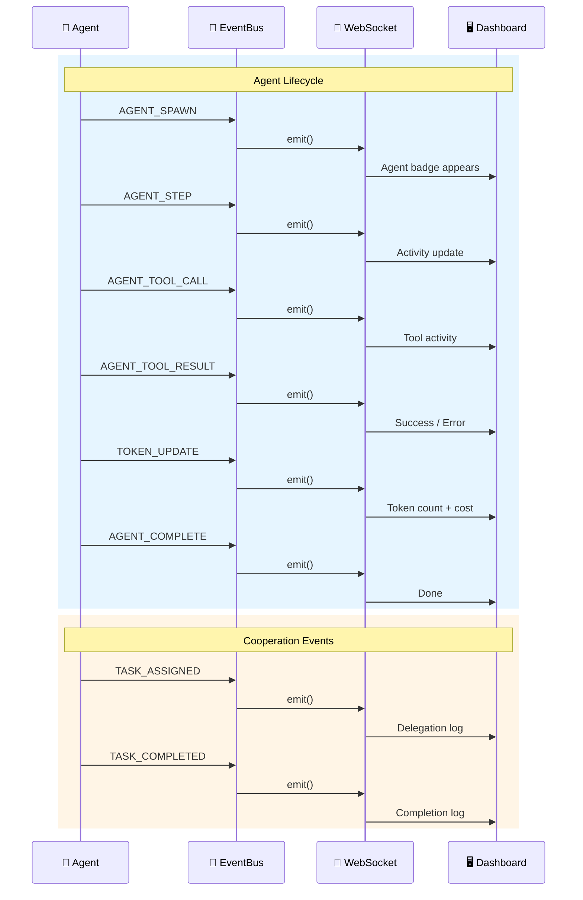
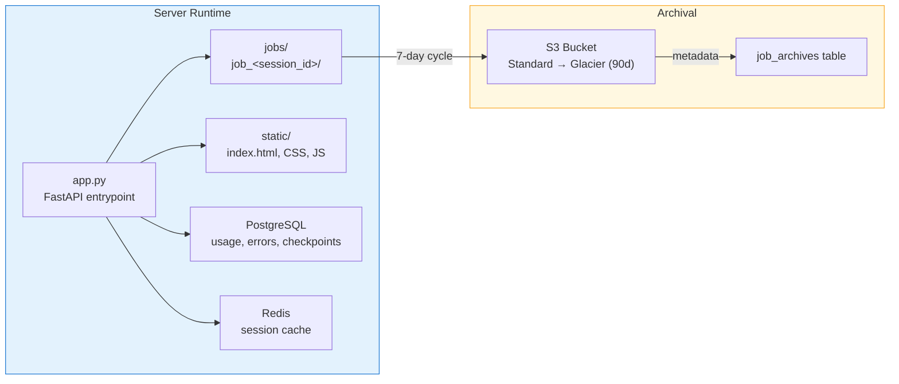

# Component Interaction Graph

## High-Level Architecture

```mermaid
graph TB
    subgraph UI_Layer["🖥️ Presentation"]
        direction LR
        UI["Static UI<br/>JS / CSS / HTML"]
        REST["REST API<br/>/api/*"]
        WS["WebSocket<br/>/ws"]
        STREAM["Streaming<br/>/ws/stream"]
    end

    subgraph Dashboard["⚙️ Dashboard (FastAPI)"]
        direction LR
        EB["EventBus<br/>(events.py)"]
        JL["JobLogger<br/>(job_logger.py)"]
        AUTH["Auth<br/>(OAuth2 + API key)"]
    end

    subgraph Execution["🔄 Execution Layer"]
        direction TB
        RT["run_team()<br/>multi-agent"]
        RA["run_agent()<br/>single agent"]
        GR["graphs.py<br/>StateGraph"]

        subgraph Skills["SkillRegistry"]
            direction LR
            FR["FileRead"] ~~~ FW["FileWrite"]
            GS["GlobSearch"] ~~~ SE["ShellExec"]
        end
    end

    subgraph Providers["☁️ Provider Layer"]
        direction LR
        AN["Anthropic<br/>Claude"]
        OA["OpenAI<br/>GPT"]
        GO["Google<br/>Gemini"]
        OR["OpenRouter<br/>free tier"]
        LO["Local<br/>Ollama"]
    end

    subgraph External["🌐 External"]
        direction LR
        INT["Cloud APIs<br/>(internet)"]
        LOC["localhost:11434<br/>(Ollama)"]
    end

    %% Presentation → Dashboard
    UI --> REST & WS & STREAM
    REST --> EB
    WS --> EB
    STREAM --> EB

    %% Dashboard → Execution
    EB --> RT
    EB --> RA
    JL -.- RT & RA

    %% Execution internal
    RT --> RA
    RT --> Skills
    RA --> Skills
    GR --> Skills

    %% Execution → Providers
    RA --> AN & OA & GO & OR & LO

    %% Providers → External
    AN --> INT
    OA --> INT
    GO --> INT
    OR --> INT
    LO --> LOC

    %% Styles
    style UI_Layer fill:#e8f4fd,stroke:#4a90d9
    style Dashboard fill:#fff3e0,stroke:#f5a623
    style Execution fill:#e8f5e9,stroke:#4caf50
    style Providers fill:#f3e5f5,stroke:#9c27b0
    style External fill:#fce4ec,stroke:#e91e63
```

## Core Module Interactions

```mermaid
graph LR
    subgraph Core["Core Pipeline"]
        direction TB
        P["provider.py<br/>ABC interface"] --> A["agent.py<br/>Agent base"]
        A --> SK["skill.py<br/>SkillRegistry"]
        A --> CO["cooperation.py<br/>Inter-agent messaging"]
        CO --> OR["orchestrator.py<br/>Coordination"]
        OR --> RO["router.py<br/>6 routing strategies"]
    end

    subgraph Graph["Graph Engine"]
        direction TB
        G["graph.py<br/>StateGraph"]
        G --> LN["llm_nodes.py<br/>LLM factories"]
        G --> RE["reducers.py<br/>State merge"]
        G --> GP["graph_patterns.py<br/>Retry / loop / map-reduce"]
        G --> GT["graph_templates.py<br/>Versioned templates"]
        G --> CP["checkpoint.py<br/>Persistence"]
        CP --> PG["checkpoint_postgres.py"]
    end

    subgraph Ops["Operations"]
        direction TB
        RO --> US["usage.py<br/>Cost & budgets"]
        RO --> HE["health.py<br/>Health monitor"]
        RL["rate_limiter.py"]
        AU["audit.py<br/>11 event types"]
        TQ["task_queue.py<br/>Priority queue"]
        ME["metrics.py<br/>Prometheus"]
        AL["alerts.py<br/>Spend alerts"]
        BM["benchmark.py"]
    end

    subgraph Ext["Extensions"]
        direction TB
        PL["plugins.py<br/>Plugin loader"]
        MC["mcp_server.py<br/>MCP registry"]
        WH["webhook.py<br/>HMAC validation"]
        AP["api.py<br/>REST / OpenAPI 3.0"]
        OF["offline.py<br/>Local-only filter"]
        CM["config_manager.py<br/>Config rollback"]
        PR["project.py<br/>Multi-project"]
        UR["users.py<br/>RBAC"]
        PP["provider_presets.py"]
        MI["migration.py<br/>LangGraph / CrewAI"]
    end

    %% Cross-subgraph connections
    A --> G
    OR --> ME
    OR --> AU
    OR --> RL
    A --> Ext

    %% Styles
    style Core fill:#e3f2fd,stroke:#1976d2
    style Graph fill:#e8f5e9,stroke:#388e3c
    style Ops fill:#fff8e1,stroke:#f9a825
    style Ext fill:#f3e5f5,stroke:#7b1fa2
```

## Dashboard Request Flow

```mermaid
sequenceDiagram
    participant B as 🖥️ Browser
    participant F as ⚙️ FastAPI
    participant T as 👥 run_team()
    participant A as 🤖 run_agent()

    rect rgb(230, 240, 255)
        Note over B,A: Multi-Agent Mode (Async)
        B->>F: POST /api/team/run
        F-->>B: {job_id, status: started}
        F->>T: asyncio.create_task()
        T-->>B: WS: team.started
        T-->>B: WS: graph.start
        T->>T: team-lead plans (LLM)
        T->>A: run_agent() x N (parallel)
        A-->>B: WS: agent.spawn / tool_call / tool_result
        T->>T: team-lead validates
        T-->>B: WS: team.complete
    end

    rect rgb(240, 255, 240)
        Note over B,A: Single Agent Mode
        B->>F: POST /api/agent/run
        F->>A: run_agent()
        A-->>B: WS events
        F-->>B: JSON response
    end

    rect rgb(255, 245, 230)
        Note over B,F: Simple Prompt (Streaming)
        B->>F: WS /ws/stream
        F-->>B: token, token, ..., done
    end
```

## Multi-Agent Team Flow

```mermaid
graph TD
    TL1["🎯 team-lead<br/>(planner)"]

    TL1 -->|"Plan decomposition"| SPLIT{{"Task<br/>Router"}}

    subgraph SW["Software Engineering"]
        direction LR
        BE["backend"]
        FE["frontend"]
        DV["devops"]
        PE["platform"]
        AI["ai-engineer"]
    end

    subgraph DS["Data Science"]
        direction LR
        DA["data-analyst"]
        ML["ml-engineer"]
        DE["data-engineer"]
    end

    subgraph FN["Finance"]
        direction LR
        FA["financial-analyst"]
        RA["risk-analyst"]
        QD["quant-developer"]
    end

    subgraph MK["Marketing"]
        direction LR
        CS["content-strategist"]
        SE["seo-specialist"]
        GH["growth-hacker"]
    end

    SPLIT --> SW
    SPLIT --> DS
    SPLIT --> FN
    SPLIT --> MK

    SW --> JOIN{{"Merge<br/>Results"}}
    DS --> JOIN
    FN --> JOIN
    MK --> JOIN

    JOIN --> TL2["✅ team-lead<br/>(summarizer)"]

    %% Styles
    style TL1 fill:#1565c0,color:#fff,stroke:#0d47a1
    style TL2 fill:#1565c0,color:#fff,stroke:#0d47a1
    style SPLIT fill:#ff8f00,color:#fff,stroke:#e65100
    style JOIN fill:#ff8f00,color:#fff,stroke:#e65100
    style SW fill:#e8f5e9,stroke:#4caf50
    style DS fill:#e3f2fd,stroke:#2196f3
    style FN fill:#fff8e1,stroke:#ffc107
    style MK fill:#fce4ec,stroke:#e91e63
```

## Event Flow (EventBus)

```mermaid
sequenceDiagram
    participant AG as 🤖 Agent
    participant EB as 📡 EventBus
    participant WS as 🔌 WebSocket
    participant UI as 🖥️ Dashboard

    rect rgb(230, 245, 255)
        Note over AG,UI: Agent Lifecycle
        AG->>EB: AGENT_SPAWN
        EB->>WS: emit()
        WS->>UI: Agent badge appears

        AG->>EB: AGENT_STEP
        EB->>WS: emit()
        WS->>UI: Activity update

        AG->>EB: AGENT_TOOL_CALL
        EB->>WS: emit()
        WS->>UI: Tool activity

        AG->>EB: AGENT_TOOL_RESULT
        EB->>WS: emit()
        WS->>UI: Success / Error

        AG->>EB: TOKEN_UPDATE
        EB->>WS: emit()
        WS->>UI: Token count + cost

        AG->>EB: AGENT_COMPLETE
        EB->>WS: emit()
        WS->>UI: Done
    end

    rect rgb(255, 245, 230)
        Note over AG,UI: Cooperation Events
        AG->>EB: TASK_ASSIGNED
        EB->>WS: emit()
        WS->>UI: Delegation log

        AG->>EB: TASK_COMPLETED
        EB->>WS: emit()
        WS->>UI: Completion log
    end
```

## Runtime File System

```mermaid
graph LR
    subgraph Server["Server Runtime"]
        direction TB
        APP["app.py<br/>FastAPI entrypoint"]
        APP --> JOBS["jobs/<br/>job_&lt;session_id&gt;/"]
        APP --> STATIC["static/<br/>index.html, CSS, JS"]
        APP --> DB["PostgreSQL<br/>usage, errors, checkpoints"]
        APP --> REDIS["Redis<br/>session cache"]
    end

    subgraph Archive["Archival"]
        direction TB
        JOBS -->|"7-day cycle"| S3["S3 Bucket<br/>Standard → Glacier (90d)"]
        S3 -->|"metadata"| PGARCH["job_archives table"]
    end

    style Server fill:#e3f2fd,stroke:#1976d2
    style Archive fill:#fff8e1,stroke:#f9a825
```
