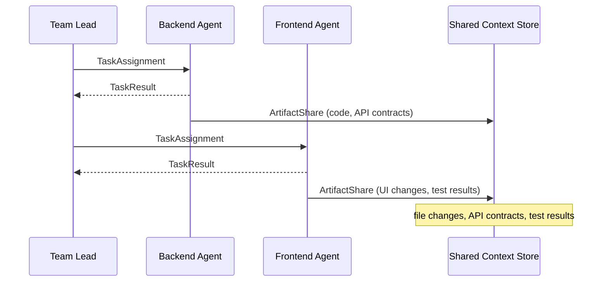

# Inter-Agent Cooperation

How agents communicate when tasks span multiple domains.

## Cooperation Patterns

- **Delegation** — team-lead assigns sub-tasks to specialists
- **Artifact sharing** — agents publish outputs (code, specs) to a shared store
- **Dependency ordering** — orchestrator ensures backend runs before frontend when needed
- **Conflict resolution** — when two agents modify the same file, team-lead resolves
