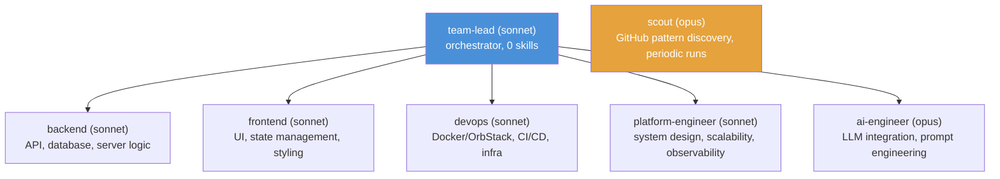

# Architecture: Provider-Agnostic Agent Orchestration

## Problem Statement

Current agent systems (Claude Code, Cursor, Copilot Workspace) are tightly coupled to a single LLM provider. This creates:

- **Vendor lock-in** — switching providers means rewriting the entire agent layer
- **No cost optimization** — can't route cheap tasks to cheap models
- **Single point of failure** — if the provider goes down, everything stops
- **No hybrid deployment** — can't mix cloud and local models

## Core Abstractions

| Concept | Description |
|---------|-------------|
| **Provider** | LLM backend (Claude, GPT, Gemini, local). Swappable per agent. |
| **Agent** | Autonomous unit with role, tools, provider. Stateless between tasks. |
| **Skill** | Reusable capability. Provider-independent. |
| **Orchestrator** | Coordinates agents, routes tasks, enforces anti-stall. |
| **Cooperation** | Inter-agent delegation, artifact sharing, conflict resolution. |
| **StateGraph** | LangGraph-inspired directed graph engine for orchestration flows. |

## Agent Team

## Mapping from Claude Code

| Claude Code | This Framework | Notes |
|-------------|---------------|-------|
| `model: sonnet/opus/haiku` | `provider: "claude-sonnet"` | Provider is explicit, not implicit |
| Agent `.md` files | `AgentConfig` YAML/Python | Richer config, same concept |
| `Agent` tool (subagent) | `orchestrator.delegate()` | Provider-agnostic delegation |
| Skills (slash commands) | `SkillRegistry` | Decoupled from any LLM |
| Hooks (PostToolUse etc.) | `EventBus` + handlers | Same pattern, more extensible |
| `CLAUDE.md` | Project config YAML | Not tied to Claude namespace |
| Memory (`MEMORY.md`) | `ContextStore` | Persistent cross-session state |

## Anti-Stall Protocol

Every agent enforces:
1. **Step limit** — configurable max steps per task (default: 10)
2. **Retry cap** — max 3 attempts per approach, then escalate
3. **Timeout** — hard wall-clock timeout per agent task
4. **Progress reporting** — agents emit progress events the orchestrator monitors
5. **Deadlock detection** — if two agents wait on each other, orchestrator breaks the cycle
