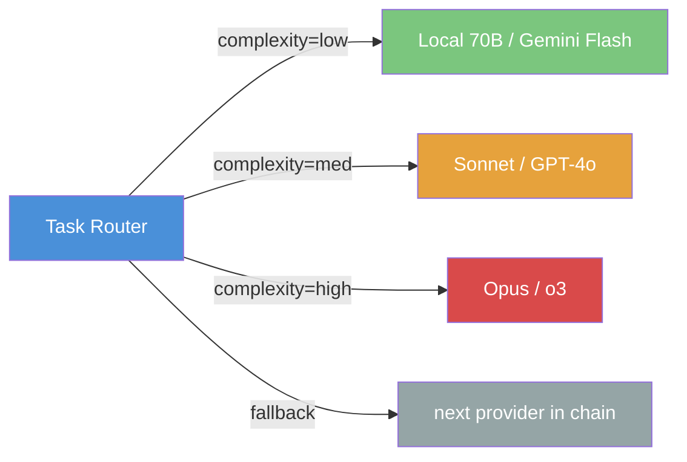

# Provider Interface

The fundamental abstraction that decouples agents from LLMs.

```python
class Provider(Protocol):
    async def complete(
        self,
        messages: list[Message],
        tools: list[Tool] | None = None,
        system: str | None = None,
        max_tokens: int = 4096,
    ) -> Completion: ...

    async def stream(
        self,
        messages: list[Message],
        tools: list[Tool] | None = None,
        system: str | None = None,
    ) -> AsyncIterator[StreamChunk]: ...

    @property
    def model_id(self) -> str: ...

    @property
    def capabilities(self) -> ModelCapabilities: ...
```

The interface uses a simple message-based protocol. Tool use is normalized to a common schema.

## Available Providers

| Provider | Class | Models |
|----------|-------|--------|
| Anthropic | `AnthropicProvider` | claude-opus-4-6, claude-sonnet-4-6, claude-haiku-4-5 |
| OpenAI | `OpenAIProvider` | gpt-4o, gpt-4o-mini, o3 |
| Google | `GoogleProvider` | gemini-2.0-flash, gemini-2.5-pro |
| OpenRouter | `OpenRouterProvider` | Any OpenRouter model (qwen, deepseek, etc.) |
| Local/Ollama | `LocalProvider` | Any Ollama model |

## Routing Strategies



## Configuration

```yaml
providers:
  claude-sonnet:
    type: anthropic
    model: claude-sonnet-4-6
  gpt-4o:
    type: openai
    model: gpt-4o
  gemini-flash:
    type: google
    model: gemini-2.0-flash
  local-llama:
    type: ollama
    model: llama3.3:70b
    base_url: http://gpu-server:11434
```
