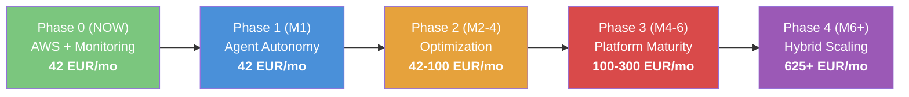

# Financial Summary

## Cost Progression

## Phase 4 Cost Breakdown

| Item | EUR/month |
|------|-----------|
| AWS EC2 + S3 + networking | 80 |
| Vast.ai H200 interruptible (252h/month inference) | 305 |
| Vast.ai H200 on-demand (108h/month fine-tuning) | 241 |
| OpenRouter (overflow/fallback) | 30 est. |
| **Total** | **~656** |

## Break-Even Analysis

- **Phase 0-1:** Infrastructure investment, no revenue yet
- **Phase 2:** Profitable at ~5 paying users (10 EUR/month each)
- **Phase 3:** Profitable at ~15 paying users or 2-3 Pro users (100 EUR/month)
- **Phase 4:** Self-hosted GPU pays for itself when OpenRouter spend would exceed 545 EUR/month
