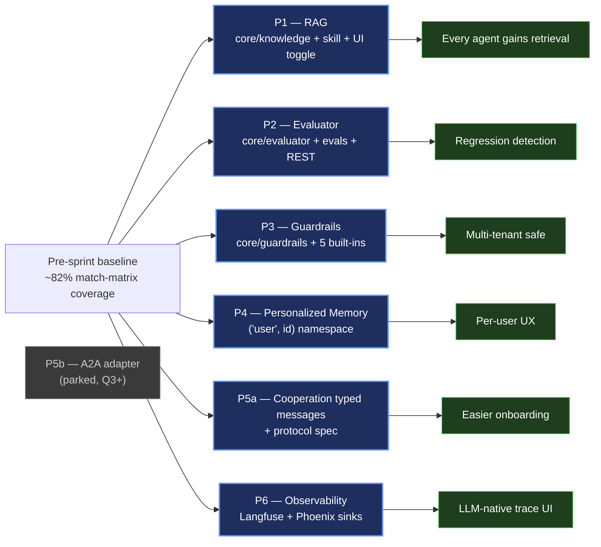
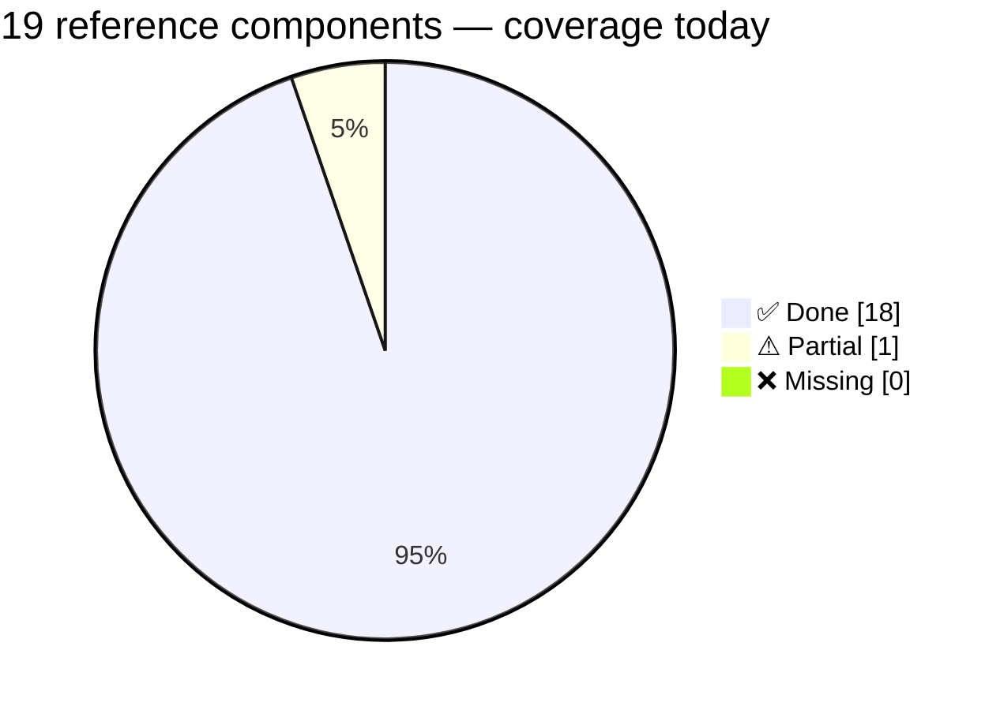
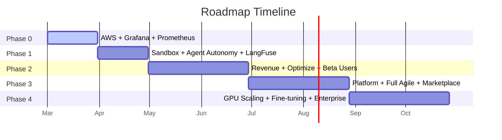

# Roadmap

## Philosophy

AWS infrastructure and monitoring come **first** — the product must be live and observable before iterating on features. Then validate agent autonomy with real sprints and sandboxed output preview. Only invest in scaling when revenue justifies it.

## Latest sprint — Q1+Q2 (May 2026)

**All six priorities from the harnessed-LLM-agent reference matrix shipped in a single afternoon, parallelised across 5 worktree agents.**

| Priority | Status | What changed |
|---|---|---|
| **P1 — RAG** | ✅ shipped | EmbeddingProvider/Chunker/KnowledgeStore ABCs, ingestion + retrieval, UI toggle, log-highlighting |
| **P2 — Evaluator** | ✅ shipped | LLMJudge + RubricEvaluator + EvalSuite, smoke dataset, CLI runner, REST API |
| **P3 — Guardrails** | ✅ shipped | PIIScanner / SecretsScanner / PromptInjectionDetector / OutputSchemaGuard / CostGuard |
| **P4 — Personalized Memory** | ✅ shipped | `("user", id)` namespace, profile extractor, GDPR wipe |
| **P5a — Cooperation messages** | ✅ shipped | typed dataclasses + sequence/state spec |
| **P6 — Observability sinks** | ✅ shipped | Langfuse + Phoenix optional exporters |
| P5b — A2A adapter | parked | Google A2A spec still moving |

➡ **[Q1+Q2 sprint deep-dive](./q1q2-sprint)** — collapsible per-priority cards with copy-pasteable try-it examples, growth graphs, and SOLID rationale.

## Coverage of the harnessed-LLM-agent reference

Up from 13 ✅ + 5 ⚠ + 1 ❌ at the start of the sprint (~82%) to **18 ✅ + 1 ⚠ + 0 ❌** today (~95%). Tests: **2065 / 2065 pass** (was 1865, +200 from this sprint).

## Earlier state (still relevant for context)

**Done before the Q1+Q2 sprint:**
- Core: Provider, Agent, Skill, Orchestrator, Cooperation, StateGraph engine
- 5 providers: Anthropic, OpenAI, Google, Ollama, OpenRouter (free models + fallback chains)
- 23 agents across 5 categories (software-engineering, data-science, finance, marketing, tooling)
- SkillKit scout agent for marketplace skill discovery (15,000+ skills)
- Dashboard: streaming, multi-turn chat, presets, file context, agent execution, cost tracking
- Checkpointing: InMemory, SQLite, PostgreSQL
- Docker/OrbStack: dashboard, postgres, test, lint, format
- 1865+ tests at the start of the sprint

**What's missing for production today:**
- Cloud deployment (AWS) — see Phase 0
- Infrastructure monitoring (Prometheus + Grafana) — see Phase 0
- Default-on Guardrails set (multi-tenant rollout)
- CI eval gate (drop-in via `python -m evals.runners.cli`)

## Phases

| Phase | Focus | Timeline | Page |
|-------|-------|----------|------|
| **Phase 0** | AWS Infrastructure + Prometheus/Grafana | **NOW** | [Details](./phase0-aws) |
| **Phase 1** | Agent Autonomy Lab (sandbox, sprints, observability) | Month 1 | [Details](./phase1-autonomy) |
| **Phase 2** | Optimization & First Revenue | Month 2-4 | [Details](./phase2-revenue) |
| **Phase 3** | Platform Maturity | Month 4-6 | [Details](./phase3-maturity) |
| **Phase 4** | Hybrid GPU Scaling | Month 6+ | [Details](./post-mvp-scaling) |

## Pre-MVP Versions (in progress)

| Version | Focus | Page |
|---------|-------|------|
| **v0.4.0** | Multi-Agent Cooperation | [Details](./v040-cooperation) |
| **v0.5.0** | Smart Routing & Cost Optimization | [Details](./v050-routing) |
| **v0.6.0** | Production Hardening | [Details](./v060-hardening) |
| **v0.7.0** | Advanced Graph Patterns | [Details](./v070-graphs) |
| **v0.8.0** | External Integrations | [Details](./v080-integrations) |
| **v1.0.0** | General Availability | [Details](./v100-ga) |
| **v1.1** | LangGraph-Inspired Improvements (channels, HITL, caching, conformance) | [Details](./v110-langgraph-improvements) |
| **v1.2** | Dynamic Team Routing (team-lead selects agents per task) | [Details](./v120-dynamic-team-routing) |

## Post-MVP: Scaling

| Version | Trigger | Focus | Page |
|---------|---------|-------|------|
| **Scaling** | Revenue > 600 EUR/mo x 2 months | GPU infra, fine-tuning, enterprise | [Details](./post-mvp-scaling) |

