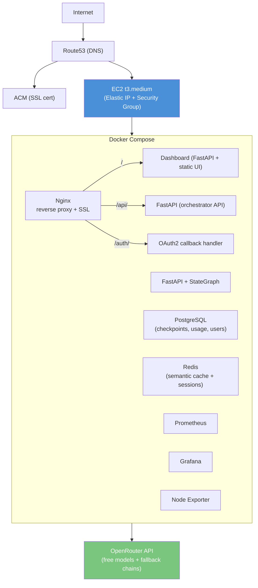
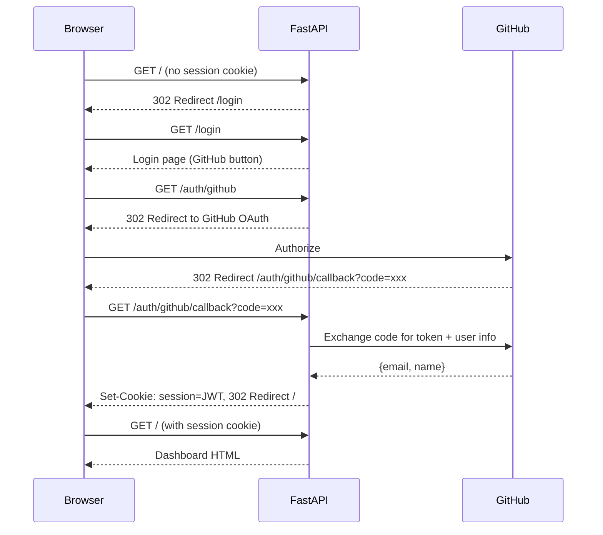

# Phase 0 — AWS Infrastructure + Auth (ASAP)

**Goal:** EC2 up, HTTPS working, OAuth2 active, first agent reachable remotely.
**Budget:** ~42 EUR/month
**Duration:** 2 sprints (2 weeks)

> **IaC:** Terraform · **CI/CD:** GitHub Actions · **Cloud:** AWS EC2 + Docker Compose
> **Auth:** OAuth2 (GitHub) + JWT session cookies · **State:** S3 + DynamoDB lock

## Architecture Target



## Sprint 1 — Terraform: Bootstrap AWS Infrastructure

### Step 1.1 — Terraform Backend (S3 + DynamoDB)

One-time manual bootstrap for state management.

### Step 1.2 — VPC + EC2 + Security Group

Terraform modules: `terraform/modules/ec2/`, `terraform/modules/networking/`, `terraform/modules/iam/`

### Step 1.3 — GitHub Actions: Terraform Pipeline

`.github/workflows/terraform.yml` — plan on PR, apply on merge to main.

**Deliverables:**
- [x] S3 bucket + DynamoDB backend (`terraform/backend/main.tf`)
- [x] `terraform apply` creates VPC, EC2 (t3.medium), SG, EIP (`terraform/modules/`)
- [x] EC2 user data: Docker + Compose + Node Exporter (`modules/ec2/user_data.sh`)
- [x] IAM role with CloudWatch, ECR pull, SSM (`modules/iam/`)
- [x] IMDSv2 required, EBS encrypted, SSH restricted
- [x] GitHub Actions: plan on PR, apply on merge (`terraform.yml`)
- [x] 26 infrastructure tests (`tests/test_terraform.py`)

## Sprint 2 — Auth OAuth2 + App Deploy + Monitoring

### Step 2.1 — OAuth2 Authentication

OAuth2 flow with JWT session cookies (authlib + PyJWT).

#### 2.1.1 — Create GitHub OAuth App

GitHub OAuth Apps cannot be created via CLI/API — web UI only.

1. Go to [github.com/settings/developers](https://github.com/settings/developers) > **OAuth Apps** > **New OAuth App**
2. Fill in:
   - **Application name:** `Agent Orchestrator`
   - **Homepage URL:** `https://agents.yourdomain.com` (or `http://localhost:5005` for local)
   - **Authorization callback URL:** `https://agents.yourdomain.com/auth/github/callback`
3. Click **Register application**
4. Copy the **Client ID**
5. Click **Generate a new client secret**, copy it immediately (shown only once)
6. Store both values in GitHub Secrets:
   ```
   OAUTH_CLIENT_ID=Ov23li...
   OAUTH_CLIENT_SECRET=abc123...
   ```

#### 2.1.2 — Generate JWT Secret

```bash
openssl rand -hex 32
```

Store as GitHub Secret: `JWT_SECRET_KEY`

#### 2.1.3 — All Required Secrets

| Secret | Source | Required |
|--------|--------|----------|
| `OAUTH_CLIENT_ID` | GitHub Developer Settings | Yes |
| `OAUTH_CLIENT_SECRET` | GitHub Developer Settings | Yes |
| `JWT_SECRET_KEY` | `openssl rand -hex 32` | Yes |
| `BASE_URL` | Your domain | Yes |
| `OPENROUTER_API_KEY` | OpenRouter dashboard | Yes (already set) |
| `AWS_ACCESS_KEY_ID` | AWS IAM | Yes |
| `AWS_SECRET_ACCESS_KEY` | AWS IAM | Yes |
| `EC2_SSH_PRIVATE_KEY` | `ssh-keygen` | Yes |

#### 2.1.4 — Auth Flow



#### 2.1.5 — Local Testing

To test OAuth locally before deploying to AWS:

```bash
# .env.local already has JWT_SECRET_KEY and BASE_URL=http://localhost:5005
# After creating the GitHub OAuth App with callback http://localhost:5005/auth/github/callback:

# Edit .env.local, fill in OAUTH_CLIENT_ID and OAUTH_CLIENT_SECRET
# Then:
set -a && source .env.local && set +a
docker compose up dashboard
# Visit http://localhost:5005 → redirects to /login → click "Login with GitHub"
```

:::caution Cookie secure flag
In `oauth_routes.py`, cookies are set with `secure=True`. This works on `localhost` in most browsers but not on LAN IPs. For local testing over LAN, temporarily set `secure=False`.
:::

#### 2.1.6 — User Store in PostgreSQL

The user store (`dashboard_users` + `dashboard_pending` tables) persists approved users, roles, and pending access requests in PostgreSQL. This is required for production — JSON file fallback only works for local dev.

**Tables:**

| Table | Columns | Purpose |
|-------|---------|---------|
| `dashboard_users` | `github_login` (PK), `email`, `name`, `role`, `active`, `created_at` | Approved users with roles |
| `dashboard_pending` | `github_login` (PK), `email`, `name`, `requested_at` | Pending access requests waiting for admin approval |

**Behavior:**
- On startup, `setup_db()` creates tables if they don't exist
- If JSON files from local dev exist (`dashboard-users.json`, `dashboard-pending.json`), data is auto-migrated to Postgres and files renamed to `.json.migrated`
- If Postgres is unavailable, all operations fall back to JSON files transparently
- Admin panel shows pending requests with approve/reject actions

**Admin flow:**
1. Unknown user tries to log in → denied, saved to `dashboard_pending`
2. Admin opens Admin panel → sees pending requests with badge count
3. Admin approves (with role) or rejects each request
4. Approved users can log in on next attempt

### Step 2.2 — Docker Compose Production

`docker-compose.prod.yml` with nginx, backend, redis, postgres, prometheus, grafana.

### Step 2.3 — GitHub Actions: Deploy Pipeline

`.github/workflows/deploy.yml` — SSH deploy + health check.

### Step 2.4 — Monitoring Board

| Task | Priority | Detail |
|------|----------|--------|
| Prometheus setup | CRITICAL | Scrape orchestrator metrics (`/metrics` endpoint) |
| Grafana dashboards | CRITICAL | Agent activity, latency, token usage, cost per model |
| Node Exporter | HIGH | EC2 system metrics (CPU, RAM, disk, network) |
| Alert rules | HIGH | Cost threshold, error rate spike, agent stall detection |

**Deliverables:**
- [x] OAuth2 GitHub working (fail-closed, security-hardened)
- [x] Dashboard accessible only after login (WebSocket pre-accept auth)
- [x] User store (users + pending requests) in PostgreSQL
- [x] Admin panel for managing users and approving access requests
- [x] bcrypt password hashing, CORS allowlist, SSRF protection
- [x] Audit logging (login/logout/denied events)
- [x] `docker-compose.prod.yml` (nginx, redis, prometheus, grafana)
- [x] Nginx: TLS 1.2+, HSTS, rate limiting, WebSocket proxy, /metrics blocked
- [x] Prometheus: dashboard + node exporter scraping, 6 alert rules
- [x] Grafana: pre-provisioned dashboard (tasks, cost, latency, CPU/RAM/disk)
- [x] GitHub Actions deploy pipeline (test → rsync → build → health check)
- [x] 30 deployment tests (`tests/test_deploy.py`)
- [ ] HTTPS active on custom domain (needs Route53 + ACM setup)
- [ ] Grafana accessible via SSH tunnel (needs EC2 running)

## KPIs

| KPI | Target |
|-----|--------|
| Deploy time (push → live) | < 5 min |
| Auth success rate | 100% |
| First token latency | < 5s |
| Uptime | 99% |
| Monthly infra cost | < 60 EUR |

## Security Checklist

- [x] SSH open only from your fixed IP (Terraform SG — `ssh_allowed_cidrs`)
- [x] `.env.prod` never in repository (GitHub Secrets only, `.gitignore`)
- [x] JWT cookie `httponly=True`, `secure=True`, `samesite=strict`, 4h expiry
- [x] Fail-closed auth (no default bypass, dev mode blocked in production)
- [x] WebSocket pre-accept authentication
- [x] CORS allowlist (no wildcard origins)
- [x] SSRF protection (Ollama URL restricted to localhost)
- [x] API keys header-only (no query param leaks)
- [x] IMDSv2 required on EC2 (prevents SSRF → metadata attacks)
- [x] Grafana not publicly exposed (no ports in docker-compose.prod.yml)
- [x] Rate limiting on `/api/*` (nginx: 10 req/s + burst 20)
- [ ] OpenRouter API key rotated every 90 days
