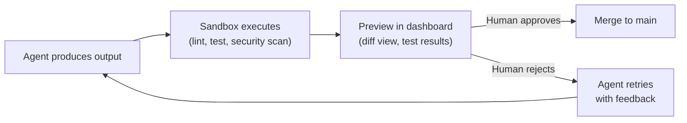

# Phase 1 — Agent Autonomy Lab (Month 1)

**Goal:** Understand how agents actually perform, test their output safely, build confidence in autonomous execution.

## 1A — Agent Output Sandbox (Preview & Test)

| Task | Detail |
|------|--------|
| E2B or Docker sandbox | Isolated environment where agents run code before it touches real files |
| Output preview | Agent generates code/changes → preview diff → human approves or rejects |
| Auto-validation pipeline | Lint + test + security scan on every agent output before merge |
| Artifact staging | Agent output goes to a staging branch/directory, not directly to main |
| Dashboard integration | Show preview diffs in the dashboard UI, approve/reject with one click |

**Flow:**

## 1B — Agile Team Experiment

| Task | Detail |
|------|--------|
| Sprint simulation | Give agents a backlog of tasks, see what they can deliver in a "sprint" |
| Team-lead as Scrum Master | Team-lead decomposes epics into stories, assigns to agents |
| Velocity tracking | Measure: tasks completed, quality score, rework rate |
| Autonomy levels | L1: human approves everything, L2: auto-merge if tests pass, L3: full autonomy |
| Retrospective data | What tasks agents handle well vs. where they fail |

## 1C — Agent Behavior Observability

| Task | Detail |
|------|--------|
| LangFuse integration | Trace every LLM call: prompt, response, latency, tokens, cost |
| Agent decision log | Why did team-lead route to agent X? Why did agent choose approach Y? |
| Failure analysis | Categorize failures: wrong approach, hallucination, tool misuse, timeout |
| Quality scoring | Auto-score agent output: does it compile? pass tests? follow conventions? |

## KPIs

- Sandbox preview working end-to-end
- First "sprint" completed with measurable velocity
- Agent success rate measured per category
- Clear data on which tasks agents handle autonomously vs. need human help
