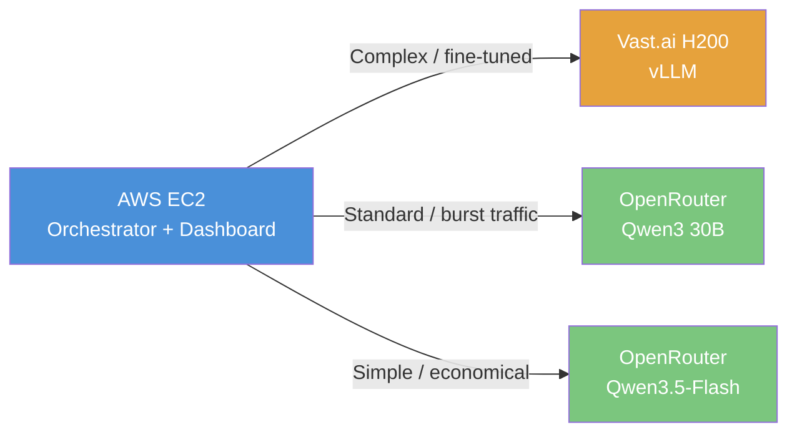

# Post-MVP — Infrastructure Scaling

**Trigger:** Monthly revenue > 600 EUR for 2 consecutive months.
**Budget:** ~625 EUR/month

:::caution Decision Gate
This phase only starts if v1.0 is shipped AND revenue justifies the investment.
Until then, the system runs on AWS t3.medium + OpenRouter at ~42-100 EUR/month.
:::

## GPU Infrastructure

| Task | Detail |
|------|--------|
| Vast.ai H200 setup | vLLM inference server for complex/fine-tuned tasks |
| Hybrid routing | Route to Vast.ai (complex) or OpenRouter (burst) |
| Model hosting | Self-host Qwen3 30B or fine-tuned variant |
| Auto-scaling | Scale between OpenRouter and self-hosted based on load |

## Fine-Tuning

| Task | Detail |
|------|--------|
| Data pipeline | Curate training data from production usage |
| Fine-tune Qwen3 30B | Domain-specific on H200 |
| A/B testing | Fine-tuned vs base model on real traffic |
| Model registry | Track versions, metrics, rollback |

## Enterprise Features

| Task | Detail |
|------|--------|
| SSO / SAML | Enterprise authentication |
| Audit logging | Full audit trail of agent actions |
| Data residency | EU, US, or self-hosted |
| SLA guarantees | Uptime and latency commitments |
| On-prem option | Package for customer self-hosting |

## Cost Breakdown

| Item | EUR/month |
|------|-----------|
| AWS EC2 + S3 + networking | 80 |
| Vast.ai H200 interruptible (252h inference) | 305 |
| Vast.ai H200 on-demand (108h fine-tuning) | 241 |
| OpenRouter (overflow/fallback) | 30 est. |
| **Total** | **~656** |

## Why Self-Hosted?

The switch to GPU is driven by **capabilities**, not cost savings:

1. **Fine-tuning** on proprietary data (impossible with OpenRouter)
2. **Total privacy** (sensitive data stays in-house)
3. **Guaranteed latency** without third-party dependency
4. **Custom domain-specific model**

At current OpenRouter pricing ($0.08/$0.28 per 1M tokens), you'd need ~260M tokens/day to match GPU cost — that's enterprise-level usage.
