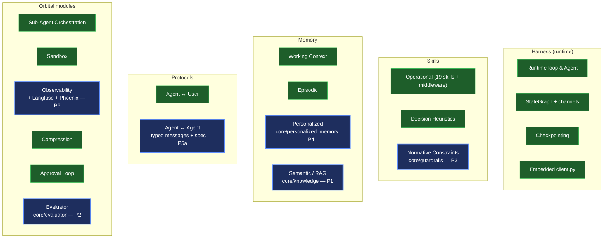
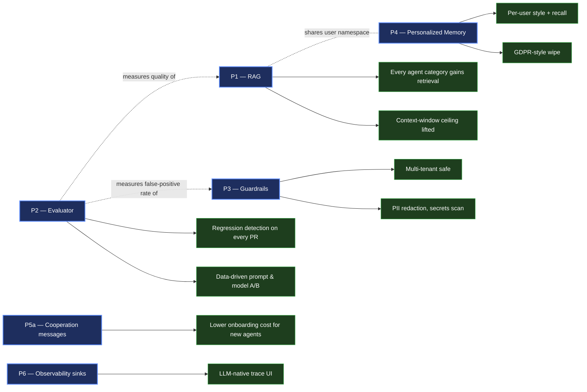

# Q1+Q2 Sprint — Deep Dive

Six priorities (P1–P6) from the harnessed-LLM-agent reference matrix, all shipped in a single afternoon by parallelising five worktree agents and converging into main.

## TL;DR — what changed

| Metric | Before sprint | After sprint |
|---|---|---|
| **Reference matrix coverage** | 13 ✅ + 5 ⚠ + 1 ❌ (~82%) | **18 ✅ + 1 ⚠ + 0 ❌ (~95%)** |
| **pytest pass count** | 1865 | **2065** (+200) |
| **vitest pass count** | 100 | 112 (+12 from RAG UI) |
| **New core abstractions** | — | KnowledgeStore, Guardrail, Evaluator, PersonalizedMemory + typed cooperation messages |
| **New REST endpoints** | — | `/api/knowledge/*`, `/api/evals/*`, `/api/user-memory/*` |
| **New optional extras** | — | `[rag]`, `[langfuse]`, `[phoenix]` |

## Status snapshot graph

Green = done before the sprint, blue = shipped during the sprint.



## Growth graph — what each priority unlocks



## Sprint timeline

Five worktree agents, ~10 minutes each, then 15 minutes of convergence. Total: under one afternoon.

```mermaid
gantt
    title Actual sprint timeline
    dateFormat HH:mm
    axisFormat %H:%M
    section Sequential (main)
    P1 RAG core (M)              :done, p1c, 11:00, 30m
    P1 RAG skill+API             :done, p1s, after p1c, 25m
    P1 RAG UI toggle             :done, p1u, after p1s, 25m
    section Parallel (worktrees)
    P3 Guardrails (S)            :done, p3, 11:50, 30m
    P2 Evaluator (M)             :done, p2, 11:50, 35m
    P4 Personalized Memory (S)   :done, p4, 11:50, 40m
    P5a Cooperation spec (S)     :done, p5a, 11:50, 20m
    P6 Observability (S)         :done, p6, 11:50, 25m
    section Convergence
    Merge worktrees + tests      :done, conv, 12:35, 15m
    Final docs + push            :done, fin, after conv, 5m
```



## Per-priority cards

> Each card collapsed by default. Click to expand for design notes, code locations, and copy-pasteable try-it commands.

<details>
<summary><strong>P1 — Semantic Knowledge / RAG</strong> &nbsp; ✅ shipped &nbsp; · &nbsp; Effort: M &nbsp; · &nbsp; Impact: 🔥🔥🔥</summary>

**Where it lives**
- `src/agent_orchestrator/core/knowledge/` — EmbeddingProvider ABC + 3 impls (HashEmbedder, sentence-transformers, OpenAI), Chunker ABC, KnowledgeStore (ISP-split), Ingester, Retriever
- `src/agent_orchestrator/skills/retrieval_skill.py` — `knowledge_retrieve` skill for agents
- `src/agent_orchestrator/dashboard/knowledge_routes.py` — `/api/knowledge/{ingest,search,namespaces,health}`
- `frontend/src/components/chat/ChatInput.tsx` — RAG checkbox + namespace input
- `frontend/src/hooks/useWebSocket.ts` — handles `type: "rag"` frame, emits "RAG: namespace · N chunks" system bubble

**Try it (60 seconds)**

```bash
# Ingest
curl -sX POST http://localhost:5005/api/knowledge/ingest \
  -H 'Content-Type: application/json' \
  -d '{"source_id":"auth-doc","namespace":"shared",
       "text":"# Auth\n\nUse JWT tokens. Sessions are stateless."}'

# Search
curl -sX POST http://localhost:5005/api/knowledge/search \
  -H 'Content-Type: application/json' \
  -d '{"query":"how do tokens work?","namespace":"shared","k":3}'

# Chat with auto-injection (or flip the RAG checkbox in the UI)
curl -sX POST http://localhost:5005/api/prompt \
  -H 'Content-Type: application/json' \
  -d '{"prompt":"How do auth tokens work?","model":"openai/gpt-4o",
       "provider":"openrouter","rag_enabled":true,"rag_namespace":"shared"}'
```

**Production swap-in**

| Embedder | Switch | Install |
|---|---|---|
| Hash (default, dev) | (built-in) | none |
| sentence-transformers | `RAG_EMBEDDING_PROVIDER=local RAG_LOCAL_MODEL=all-MiniLM-L6-v2` | `pip install -e ".[rag]"` |
| OpenAI | `RAG_EMBEDDING_PROVIDER=openai RAG_OPENAI_MODEL=text-embedding-3-small` | `pip install -e ".[openai]"` |

</details>

<details>
<summary><strong>P2 — Evaluator framework</strong> &nbsp; ✅ shipped &nbsp; · &nbsp; Effort: M &nbsp; · &nbsp; Impact: 🔥🔥🔥</summary>

**Where it lives**
- `src/agent_orchestrator/core/evaluator.py` — Evaluator ABC, LLMJudge, RubricEvaluator (regex/contains/JSON-schema/length), EvalSuite, JsonDataset, EvalReport
- `evals/datasets/smoke.json` — 5 hand-picked smoke cases
- `evals/runners/cli.py` — `python -m evals.runners.cli --suite ... --dry-run`
- `src/agent_orchestrator/dashboard/evals_routes.py` — `/api/evals/{run,runs,runs/{id},compare}`

**Try it**

```bash
# Local dry-run (no LLM call)
python -m evals.runners.cli --suite evals/datasets/smoke.json --dry-run

# REST (background)
curl -sX POST http://localhost:5005/api/evals/run \
  -H 'Content-Type: application/json' \
  -d '{"suite_path":"evals/datasets/smoke.json","agent":"team-lead",
       "model":"openai/gpt-4o","provider":"openrouter"}'
```

</details>

<details>
<summary><strong>P3 — Guardrails layer</strong> &nbsp; ✅ shipped &nbsp; · &nbsp; Effort: S &nbsp; · &nbsp; Impact: 🔥🔥</summary>

**Where it lives**
- `src/agent_orchestrator/core/guardrails.py` — Guardrail ABC + GuardrailManager + PIIScanner, SecretsScanner, PromptInjectionDetector, OutputSchemaGuard, CostGuard
- `src/agent_orchestrator/core/agent.py` — `Agent.execute()` calls `run_input` pre-LLM and `run_output` post-LLM
- `orchestrator.yaml.example` — YAML config block
- Events: `guardrail.checked / blocked / redacted`

**Try it (Python)**

```python
from agent_orchestrator.core.guardrails import GuardrailManager, PIIScanner, SecretsScanner

mgr = GuardrailManager()
mgr.register(PIIScanner(action="redact"))
mgr.register(SecretsScanner(action="block"))

agent = Agent(config=..., provider=..., skill_registry=..., guardrails=mgr)
# Now every Agent.execute() runs input/output checks automatically.
```

</details>

<details>
<summary><strong>P4 — Personalized Memory</strong> &nbsp; ✅ shipped &nbsp; · &nbsp; Effort: S &nbsp; · &nbsp; Impact: 🔥🔥</summary>

**Where it lives**
- `src/agent_orchestrator/core/personalized_memory.py` — `PersonalizedMemory(BaseStore)` facade with put/get/list/delete/wipe
- `src/agent_orchestrator/skills/profile_extractor_skill.py` — extracts preferences from history
- `src/agent_orchestrator/dashboard/personalized_memory_routes.py` — `/api/user-memory/users/*`
- `src/agent_orchestrator/core/agent.py` — `<user_profile>` block in system prompt when `user_id` + `personalized_memory` are set

**Try it**

```bash
# Save
curl -sX PUT http://localhost:5005/api/user-memory/users/u-123/style \
  -H 'Content-Type: application/json' \
  -d '{"value":{"prefers":"concise, code blocks > prose"}}'

# Read
curl -s http://localhost:5005/api/user-memory/users/u-123

# GDPR wipe
curl -sX DELETE http://localhost:5005/api/user-memory/users/u-123
```

</details>

<details>
<summary><strong>P5a — Cooperation typed messages + spec</strong> &nbsp; ✅ shipped &nbsp; · &nbsp; Effort: S &nbsp; · &nbsp; Impact: 🔥</summary>

**Where it lives**
- `src/agent_orchestrator/core/cooperation_messages.py` — frozen dataclasses (`DelegateMessage`, `ResultMessage`, `CapabilityQueryMessage`, `CapabilityResponseMessage`, `ConflictMessage`) + `parse_message()` dispatcher
- The legacy dict-based callers in `core/cooperation.py` keep working — typed classes are additive
- Full sequence + state diagrams: `docs/cooperation-protocol.md` (top-level, GitHub-rendered)

**P5b status** — parked. Google's A2A spec is still moving (April 2026). Re-evaluate in Q3.

</details>

<details>
<summary><strong>P6 — Observability sinks (Langfuse + Phoenix)</strong> &nbsp; ✅ shipped &nbsp; · &nbsp; Effort: S &nbsp; · &nbsp; Impact: 🔥</summary>

**Where it lives**
- `src/agent_orchestrator/core/observability/` — LangfuseSpanExporter + PhoenixSpanExporter, both opt-in
- `src/agent_orchestrator/core/tracing.py` — `setup_tracing()` calls `register_optional_exporters()`
- `pyproject.toml` — new `[langfuse]` and `[phoenix]` extras (rolled into `[all]`)
- Existing Tempo/OTel pipeline keeps working alongside

**Turn on (env-driven)**

```bash
# Langfuse
pip install -e ".[langfuse]"
export LANGFUSE_PUBLIC_KEY=pk-… LANGFUSE_SECRET_KEY=sk-… LANGFUSE_HOST=https://cloud.langfuse.com

# Phoenix (local)
pip install -e ".[phoenix]"
docker run -d -p 6006:6006 arizephoenix/phoenix:latest
export PHOENIX_COLLECTOR_ENDPOINT=http://localhost:6006
```

</details>

## Why parallel beat sequential

The five priorities are mostly disjoint. Where they overlap (`core/agent.py`, `dashboard/app.py`, `dashboard/events.py`, `CLAUDE.md`, `docs/abstractions.md`), every edit is **additive** — each agent appends, none rewrite. SOLID compliance pays off at convergence: the new abstractions plug into existing seams (`Agent.__init__` kwargs, `app.state.*`, `EventBus`) without colliding.

Convergence in practice = three-way merge with two short conflict resolutions on `agent.py` (combined kwargs) and `app.py` (combined router includes). Less than 15 minutes of manual work.

## What's next

1. **Hook P3 Guardrails into production agents** — pick a default-on safe set (PII redact + Secrets block) for multi-tenant deployments.
2. **Wire P2 Evaluator into CI** — add a smoke suite as a GitHub Action gate that fails PRs on regression > 5%.
3. **Swap RAG defaults** — production should use `LocalEmbeddingProvider` (sentence-transformers) or `OpenAIEmbeddingProvider`, with a PgVector backend instead of `InMemoryKnowledgeStore` once corpus grows.
4. **Re-evaluate P5b A2A** in Q3 once the Google A2A spec stabilises.
