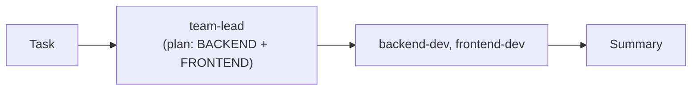
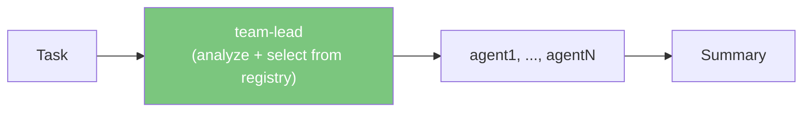

# v1.2 — Dynamic Team Routing

**Goal:** Replace the hardcoded `backend-dev + frontend-dev` team in `run_team()` with a dynamic decision layer where team-lead selects the right agents per task.

**Problem:** `run_team()` always spawns exactly two sub-agents (`backend-dev`, `frontend-dev`) regardless of the task. With 22+ agents across 5 categories, tasks like "set up CI/CD" or "optimize LLM costs" get routed to the wrong agents.

---

## Current Flow (hardcoded)



The team-lead's system prompt forces decomposition into exactly two roles. The sub-agent list is a Python literal in `agent_runner.py:462-489`.

---

## Target Flow (dynamic)



### Phase 1: Agent-Aware Planning

| Task | File | Status |
|------|------|--------|
| Inject agent registry into team-lead planning prompt | `agent_runner.py` | Done |
| Team-lead outputs structured JSON with agent assignments | `agent_runner.py` | Done |
| Parse and validate agent selection against registry | `agent_runner.py` | Done |

The team-lead receives the full list of available agents with descriptions:

```
Available agents:
- backend-dev: API design, database, server logic, testing
- frontend-dev: UI components, state management, styling, UX
- devops: Docker, CI/CD, infrastructure, deployment
- platform-engineer: system design, scalability, observability
- ai-engineer: LLM integration, prompt engineering, model evaluation
- data-analyst: exploratory analysis, statistical testing, visualization
- ...
```

And responds with structured assignments:

```json
[
  {"agent": "devops", "task": "Create Dockerfile and docker-compose.yml for the service"},
  {"agent": "backend-dev", "task": "Implement the REST API endpoints with FastAPI"}
]
```

### Phase 2: Dynamic Execution

| Task | File | Status |
|------|------|--------|
| Replace hardcoded sub-agent list with dynamic dispatch | `agent_runner.py` | Done |
| Load agent roles/prompts from `agents_registry.py` | `agent_runner.py` | Done |
| Support 1-N agents per task (not always 2) | `agent_runner.py` | Done |
| Parallel execution for independent sub-tasks | `agent_runner.py` | Done |

### Phase 3: Feedback & Validation

| Task | File | Status |
|------|------|--------|
| Team-lead validates sub-agent outputs before summary | `agent_runner.py` | Done |
| Re-delegation if agent output is insufficient | `agent_runner.py` | Done |
| Dashboard UI shows dynamic agent selection | `static/app.js` | Planned |

---

## Key Design Decisions

### Why not use the existing `TaskRouter`?

`TaskRouter` routes **single tasks to single agents** based on complexity/cost. This is different: team-lead **decomposes one task into multiple sub-tasks** and assigns each to the best agent. They're complementary:

- `TaskRouter` → single-agent mode (pick the best one)
- `run_team()` → multi-agent mode (team-lead coordinates N agents)

### Fallback behavior

If team-lead selects an agent not in the registry, fall back to the closest match or ask for re-planning. If team-lead returns invalid JSON, fall back to current hardcoded behavior (backend + frontend).

### Cost implications

Dynamic routing may select more agents than before (3-4 instead of 2). The planning step adds ~500 tokens. Net cost depends on whether the right agents produce better results in fewer steps.

---

## KPIs

- Team-lead correctly selects relevant agents for 90%+ of tasks
- No regression in task completion quality
- Support for 1-N dynamic agent assignments
- Dashboard shows which agents were selected and why
