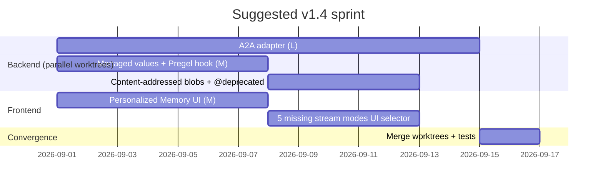

# v1.4 — External Reference Gap Closure (Q3 2026, planned)

Cross-analysis of three reference projects in `analysis/` — **DeepFlow**, **Harnessed-LLM-Agent**, **LangGraph** — to find what the orchestrator still lacks. After verifying every candidate against `src/`, the previous draft was 80 % wrong: most "gaps" turned out to already be on `main`. This page lists **only what grep + UI inspection confirmed is genuinely missing**.

## TL;DR

| Metric | Today | After v1.4 |
|---|---|---|
| **Reference matrix coverage** | 18 ✅ + 1 ⚠ + 0 ❌ (~95 %) | **19 ✅** (target) |
| **LangGraph stream modes** | 2 of 7 (`events`, `values`) | **7 of 7** |
| **Personalized Memory** | REST only | REST + UI |
| **Cross-protocol agent peers** | dict-based + typed | + A2A bidirectional bridge |

## Confirmed shipped — do NOT re-do

For traceability — these were on the original gap draft but already live on `main`:

| Candidate | Where it lives now |
|---|---|
| Loop detection middleware | `core/loop_detection.py` (+ `tests/test_loop_detection.py`) |
| Sandboxed code execution | `core/sandbox.py`, `skills/sandboxed_shell.py` |
| Progressive skill loading | `skills/skill_loader.py` |
| Structured clarification protocol | `core/clarification.py`, `skills/clarification_skill.py` |
| Dangling tool-call recovery | `core/tool_recovery.py::recover_dangling_tool_calls` |
| Typed channels (`LastValue` / `Topic` / …) | `core/channels.py` |
| Per-node CachePolicy | `core/cache.py` |
| Skill middleware chain | `core/skill.py` (+ `tests/test_skill_middleware.py`) |
| `RetryPolicy` + circuit breaker | `core/resilience.py::RetryPolicy`, `CircuitBreaker`, `resilient_call` |
| Conformance test suite | `core/conformance.py` |
| `tool_description` on tool calls | `core/skill.py` (`SkillRequest.metadata["tool_description"]`) |
| Configurable summarisation triggers | `core/conversation.py::SummarizationConfig` (TOKEN / MESSAGE / FRACTION + `retain_last`) |
| Config versioning + auto-upgrade | `core/yaml_config.py` (`config_version`, `_upgrade_v0_to_v1`, `CURRENT_CONFIG_VERSION`) |
| Memory upload filter | `core/memory_filter.py::MemoryFilter` |

## Genuinely missing — the v1.4 scope

### P1 — Must-have

#### A2A adapter (un-park P5b)

The single ⚠ in the harnessed-LLM-agent 19-item match matrix. Builds on top of `core/cooperation_messages.py` (already in `main`).

**Goal**: bidirectional bridge with Google's A2A protocol so external A2A agents appear as local cooperation peers — and vice-versa.

**Why now**: spec churn was the reason for the Q1 park; the April-2026 stabilisation has landed.

**Where it will live**: `core/cooperation/a2a_adapter.py`, plus a discovery endpoint under `/api/a2a/`.

#### Managed values (computed state)

LangGraph-style read-only injections into node state: `step_count`, `remaining_steps`, `interrupt_ids`, `is_final_step`. Computed at runtime by the engine, **never checkpointed**. Lets nodes self-throttle without polluting `State` schemas.

```python
# After v1.4
async def writer_node(state, *, remaining_steps):
    if remaining_steps < 2:
        return {"messages": [summarise_and_finish(state)]}
    return {"messages": [continue_drafting(state)]}
```

**Where it will live**: new `core/managed_values.py` + Pregel-loop hook in `core/graph.py`.

### P2 — Nice-to-have

#### Personalized Memory dashboard UI

REST endpoints `/api/user-memory/users/*` exist since v1.3.0 P4, but no React page consumes them (verified — `frontend/src/components/` has no `user-memory` references).

**Build**: `frontend/src/components/memory/UserMemoryPanel.tsx` that:
- Lists per-user keys with values
- Lets the user edit / delete entries (REST `PUT` / `DELETE`)
- Shows the last `<user_profile>` block injected into the system prompt
- GDPR wipe button → `DELETE /api/user-memory/users/{user_id}`

#### Granular stream modes (close the gap to LangGraph 7)

`dashboard/sse.py` exposes 2 of LangGraph's 7 modes today: `events` (default) and `values`. Add the 5 missing:

| Mode | Frame contents |
|---|---|
| `updates` | per-node delta only (smaller payloads) |
| `messages` | LLM message stream only |
| `tasks` | task lifecycle events only |
| `debug` | verbose internal — node enter/exit, channel writes |
| `custom` | user-emitted via `emit("event", payload)` |

Selectable per WebSocket subscription. Reduces frontend filtering load and matches LangGraph SDK consumers.

### P3 — Optional

#### Content-addressed checkpoint blobs

In `core/store_postgres.py` / `PostgresCheckpointer`, split large state values into a `blobs(sha256 PRIMARY KEY, payload BYTEA)` table and reference by hash. Repeated values across checkpoints share a single row.

**Expected impact**: 5-20× storage reduction on long conversations where the same RAG context or system prompt repeats.

#### Structured deprecation annotations

```python
@deprecated(since="1.4", removed_in="1.6", migration="use X instead")
def old_api(...): ...
```

Emits a `DeprecationWarning` at call sites + powers a `docs/deprecations.md` page generated at release time. Currently zero `@deprecated` / `DeprecationWarning` hits in `core/`. Pre-requisite for any 2.x cleanup pass.

## Sprint shape



| Worktree | Owner | Item |
|---|---|---|
| 1 | backend | A2A adapter (largest) |
| 2 | architect | Managed values (Pregel-loop change — needs careful design) |
| 3 | backend | Content-addressed blobs + deprecation decorator (both small, same dev) |
| 4 | frontend | Personalized Memory UI + 5 missing stream-modes UI selector |

**Match-matrix target**: **19/19 ✅** by end of sprint.

## What this page replaces

- The earlier `analysis/ROADMAP.md` v1.4 draft contained 16 items; 10 turned out to be already shipped after a `grep` pass against `src/`.
- The verified-shipped table at the top of this page is the audit trail of that pruning so a future agent doesn't rewind it.
